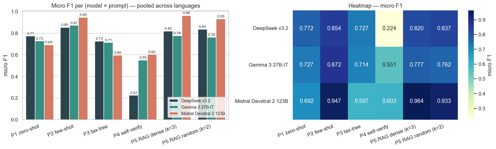

# LLM Code-Smell Detection: An Empirical Evaluation of Prompting Strategies

Empirical study of three instruction-tuned LLMs (DeepSeek v3.2 671B, Gemma 3 27B-IT,
Mistral Devstral 2 123B) under five prompting strategies (zero-shot, few-shot,
taxonomy-tree CoT, self-verify, RAG) on a Fowler-aligned, expert-annotated
code-smell benchmark spanning Java, Python, JavaScript, and C++.

- **Best configuration:** Mistral Devstral 2 123B + P5 dense RAG → **micro F1 0.964**
  on the SmellyCode test split (paired-bootstrap 95% CI on Δ vs. P1: [0.191, 0.365]).
- **Headline empirical findings:**
  - Few-shot is the single largest universal lever (+0.16 mean F1 across models).
  - Taxonomy-tree CoT and self-verify *degrade* accuracy on this task.
  - Dense retrieval beats random retrieval significantly only for the strongest model.
- **Repository:** <https://github.com/bibekgupta3333/code-smell/>
- **Paper:** [paper/main.tex](paper/main.tex)

---

## Headline Results (see [paper §VI](paper/main.tex))



*Figure: Pooled micro F1 across all (model, prompt) cells. Mistral Devstral 2 123B with P5 dense RAG dominates; few-shot is the strongest universal lever; self-verify is catastrophic for DeepSeek and harmful for Gemma. See [paper §VI](paper/main.tex) for discussion.*

---

## Repository layout

```
code-smell/
├── paper/                  # Final IEEE paper (main.tex, references.bib, figures/)
├── srccode/                # Experiment runners
│   ├── run_p1_zero_shot.py
│   ├── run_p2_few_shot.py
│   ├── run_p3_taxonomy_tree.py
│   ├── run_p4_self_verify.py
│   ├── run_p5_rag.py
│   ├── build_rag_index.py
│   └── common/             # Shared runner, prompt loader, evaluator, RAG context
├── prompts/                # Per-language prompt templates (p1–p5) + shared schema
├── prepared_data/          # Harmonised benchmark (annotated / unannotated)
│   └── datasets/
├── data/datasets/SmellyCodeDataset/   # Source dataset (Sadik, HRI-EU)
├── results/                # Per-record CSVs, metrics, predictions, figures
│   ├── llm_runs/<model>/<prompt>/...
│   ├── tables/final_comparative/      # CSVs feeding paper tables
│   └── figures/                       # Figures consumed by the paper
├── notebooks/              # EDA + final comparative analysis
├── chromadb_store/         # Persisted retrieval index (built by build_rag_index)
├── cache/embeddings/       # Sentence-transformer embeddings per language
├── config.py               # Paths and global config
├── package.json            # `npm run …` shortcuts for every (prompt × language)
└── requirements.txt
```

---

## Benchmark

- **Dataset:** SmellyCodeDataset (Sadik, HRI-EU) — 34 files, 473 line-level smell
  labels, 21 distinct Fowler smell types in 5 categories.
- **Languages:** Java (7), Python (7), JavaScript (7), C++ (13 — `.cpp` / `.h` pairs).
- **Split:** language-stratified 60 / 20 / 20 train/val/test, seed = 42.
- **Output schema:** `findings = [{line, smell, category, evidence, confidence}]`,
  enforced by [prompts/_output_schema.md](prompts/_output_schema.md) and parsed
  by [srccode/common/evaluator.py](srccode/common/evaluator.py).

---

## Models and decoding

All three models are served via AWS Bedrock with deterministic decoding
(`temperature=0`, `top_p=1`, fixed seed = 42).

| Model | Family | Architecture | Context |
|---|---|---|---|
| DeepSeek v3.2 671B | DeepSeek | Sparse MoE (~37B active) | ~128K |
| Gemma 3 27B-IT | Google | Dense | 8K–32K |
| Mistral Devstral 2 123B | Mistral | Dense | 256K |

---

## Prompting strategies

| ID  | Name              | Description                                                       |
|-----|-------------------|-------------------------------------------------------------------|
| P1  | Zero-shot         | Schema-only instruction, no examples                              |
| P2  | Few-shot          | In-context examples per language                                  |
| P3  | Taxonomy-tree CoT | Walk the 5 Fowler categories before emitting findings             |
| P4  | Self-verify       | Two-pass propose-then-critique on the same file                   |
| P5  | RAG (dense, k=3)  | Retrieve k=3 train exemplars via SBERT cosine similarity          |
| P5* | RAG (random, k=2) | Null-retriever ablation: random exemplars from the train split    |

Prompt templates live under [prompts/](prompts/) (one folder per language).

---

## Setup

```bash
# Python 3.12 recommended
python -m venv .venv
source .venv/bin/activate
pip install -r requirements.txt
```

The runner supports three providers selected via `--provider`:

| `--provider` | Backend                                  | Default model                |
|--------------|------------------------------------------|------------------------------|
| `local`      | Ollama desktop at `http://localhost:11434` | `qwen3:0.6b`               |
| `cloud`      | Ollama Cloud at `https://ollama.com`       | `deepseek-v4-flash:cloud`  |
| `bedrock`    | AWS Bedrock (`bedrock-runtime` `converse`) | `mistral.devstral-2-123b`  |

The paper results were produced with `--provider bedrock` against three
specific Bedrock model IDs (DeepSeek v3.2, Gemma 3 27B-IT, Mistral Devstral 2 123B)
using deterministic decoding (`temperature=0`, `top_p=1`, seed=42).

### Option A: Local Ollama (free, on your machine)

1. Install Ollama from <https://ollama.com/download>.
2. Pull a coding-capable model:
   ```bash
   ollama pull qwen2.5-coder:7b
   # or, for the runner's default:
   ollama pull qwen3:0.6b
   ```
3. Run an experiment:
   ```bash
   python -m srccode.run_p1_zero_shot \
     --provider local \
     --model qwen2.5-coder:7b \
     --dataset annotated --split python --verbose
   ```

No environment variables are required — `OLLAMA_HOST` defaults to
`http://localhost:11434`.

### Option B: Ollama Cloud (managed, larger models)

```bash
export OLLAMA_HOST=https://ollama.com
export OLLAMA_API_KEY=<your-ollama-cloud-key>

python -m srccode.run_p2_few_shot \
  --provider cloud \
  --model gpt-oss:120b \
  --dataset annotated --split java --verbose
```

### Option C: AWS Bedrock (used for the paper)

1. Get access to the model IDs you want to use in the AWS Bedrock console
   (the paper uses DeepSeek v3.2, Gemma 3 27B-IT, Mistral Devstral 2 123B).
2. Authenticate with **one** of:
   - **Standard AWS credentials** — `aws configure`, SSO, IAM role, or
     environment variables (`AWS_ACCESS_KEY_ID`, `AWS_SECRET_ACCESS_KEY`,
     `AWS_SESSION_TOKEN`).
   - **Short-term Bedrock API key (bearer token)** — set
     `BEDROCK_API_KEY` (or `AWS_BEARER_TOKEN_BEDROCK`).
3. Set the region (default `ap-southeast-2`, Sydney):
   ```bash
   export AWS_REGION=ap-southeast-2
   ```
4. Optionally override the default model:
   ```bash
   export BEDROCK_MODEL_ID=mistral.devstral-2-123b
   # or pass --model on the CLI
   ```
5. Run an experiment:
   ```bash
   python -m srccode.run_p5_rag \
     --provider bedrock \
     --model mistral.devstral-2-123b \
     --dataset annotated --split python --rag-mode dense --rag-k 3 --verbose
   ```

### Build the dense retrieval index (once, before P5 dense)

```bash
python -m srccode.build_rag_index
```

This persists embeddings under `cache/embeddings/` and a ChromaDB collection
under `chromadb_store/`.

---

## Running experiments

Every prompt × language × provider combination is exposed as an `npm run`
shortcut in [package.json](package.json). Underlying CLI:

```bash
python -m srccode.run_p<N>_<name> \
  --provider bedrock \
  --dataset annotated \
  --split {python|java|javascript|cpp} \
  [--rag-mode {dense|random}] [--rag-k 3] \
  --verbose
```

Convenience scripts:

```bash
# Single cell
npm run p2:bedrock:py        # Few-shot, Python, Bedrock

# All five prompts for one language
npm run all:cloud:java       # (cloud == bedrock)

# Full grid (4 languages × 5 prompts) for the active provider
npm run all:cloud
```

Each run writes three artifacts under
`results/llm_runs/<model>/<prompt>/`:

- `*.metrics.json` — micro/macro P/R/F1, per-smell breakdown, paired-bootstrap CIs
- `*.per_record.csv` — one row per file/record with predicted vs. gold findings
- `*.predictions.json` — raw model outputs (parsed JSON + tags)

The `_k{2,3}` and `random_k{2,3}` suffixes in filenames encode the retrieval
ablation tag.

---

## Reproducing the paper

All figures and tables in [paper/main.tex](paper/main.tex) are regenerated from
the artifacts in `results/` by the analysis notebook in `notebooks/`.

Key result tables live under
`results/tables/final_comparative/` (`01_headline_micro_macro.csv`,
`04_error_mix.csv`, `05_cost_latency.csv`, etc.) and the figures under
`results/figures/` and `paper/figures/`.

---

## Threats and limitations (honest)

The paper's §VII-D explicitly enumerates what was **not** done:

- **Single-seed runs.** One pass per (model, prompt, language) at T=0; no
  multi-seed / multi-paraphrase variance estimate.
- **No contamination probe.** Files are publicly hosted on GitHub; we did not
  measure n-gram overlap between test files and pretraining corpora or the
  retrieval pool.
- **No retrieval-leakage check.** Per-record cosine similarity to the top-1
  train neighbour was not measured.
- **Deployment equivalence.** Numbers characterize the Bedrock-served deployment;
  self-hosted inference may differ.
- **No fine-tuned encoder baseline** (CodeBERT / CodeT5 / UniXcoder) on the same
  split.
- **No qualitative error analysis** of held-out false positives / false negatives.
- **Sample size.** n = 34 files / 473 labels — the headline 0.964 should be
  read as a benchmark-specific upper bound, not a population-level estimate.

---

## Citation

```bibtex
@misc{gupta2026smellllm,
  title        = {An Empirical Evaluation of Large Language Models and
                  Retrieval-Augmented Prompting Strategies for Multi-Language
                  Code Smell Detection},
  author       = {Gupta, Bibek},
  year         = {2026},
  howpublished = {\url{https://github.com/bibekgupta3333/code-smell/}}
}
```

Dataset:

```bibtex
@misc{sadik2025smellycode,
  title        = {SmellyCodeDataset},
  author       = {Sadik, Ahmed R.},
  year         = {2025},
  howpublished = {Honda Research Institute Europe GmbH}
}
```

---

## License

Code: MIT. Dataset: see upstream `data/datasets/SmellyCodeDataset/` license.
