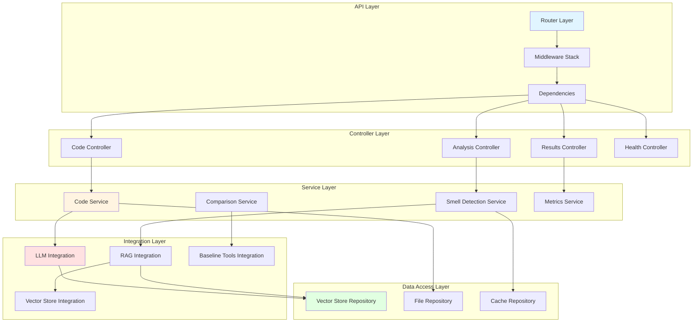

# Backend Architecture
## FastAPI-Based Code Review Service

**Version:** 1.0  
**Last Updated:** February 9, 2026

---

## 1. Backend Architecture Overview



---

## 2. Project Structure

```
backend/
├── apps/
│   ├── __init__.py
│   ├── api/                      # API layer
│   │   ├── __init__.py
│   │   ├── routes/               # Route definitions
│   │   │   ├── __init__.py
│   │   │   ├── code_analysis.py  # Code analysis endpoints
│   │   │   ├── results.py        # Results retrieval endpoints
│   │   │   ├── comparison.py     # Comparison endpoints
│   │   │   └── health.py         # Health check endpoints
│   │   ├── dependencies.py       # Dependency injection
│   │   └── middleware.py         # Custom middleware
│   │
│   └── service/                  # Business logic
│       ├── __init__.py
│       ├── code_service.py       # Code processing service
│       ├── smell_detection_service.py  # Smell detection orchestration
│       ├── comparison_service.py       # Baseline comparison service
│       ├── metrics_service.py    # Metrics calculation
│       └── result_processor.py   # Result formatting
│
├── core/                         # Core configuration
│   ├── __init__.py
│   ├── config.py                 # Configuration management
│   ├── settings.py               # Pydantic settings
│   ├── logging_config.py         # Logging setup
│   ├── constants.py              # Application constants
│   └── exceptions.py             # Custom exceptions
│
├── services/                     # External integrations
│   ├── __init__.py
│   ├── llm/                      # LLM service
│   │   ├── __init__.py
│   │   ├── ollama_client.py      # Ollama client wrapper
│   │   ├── prompt_builder.py     # Prompt construction
│   │   └── response_parser.py    # Response parsing
│   │
│   ├── rag/                      # RAG pipeline
│   │   ├── __init__.py
│   │   ├── embedding_service.py  # Embedding generation
│   │   ├── retrieval_service.py  # Vector search
│   │   └── context_builder.py    # Context assembly
│   │
│   ├── vector_store/             # Vector store service
│   │   ├── __init__.py
│   │   ├── chromadb_client.py    # ChromaDB client
│   │   └── vector_operations.py  # Vector operations
│   │
│   └── baseline/                 # Baseline tools
│       ├── __init__.py
│       ├── sonarqube_client.py   # SonarQube integration
│       └── pmd_client.py         # PMD integration
│
├── models/                       # Data models
│   ├── __init__.py
│   ├── requests/                 # Request models
│   │   ├── __init__.py
│   │   ├── code_analysis.py
│   │   └── comparison.py
│   │
│   ├── responses/                # Response models
│   │   ├── __init__.py
│   │   ├── analysis_result.py
│   │   └── comparison_result.py
│   │
│   └── domain/                   # Domain models
│       ├── __init__.py
│       ├── code_smell.py
│       └── analysis_state.py
│
├── utils/                        # Utilities
│   ├── __init__.py
│   ├── code_parser.py            # Code parsing utilities
│   ├── validators.py             # Input validation
│   ├── formatters.py             # Output formatting
│   └── helpers.py                # Helper functions
│
├── repositories/                 # Data access
│   ├── __init__.py
│   ├── vector_store_repository.py
│   ├── file_repository.py
│   └── cache_repository.py
│
├── workflows/                    # LangGraph workflows
│   ├── __init__.py
│   ├── smell_detection_graph.py  # Main detection workflow
│   └── comparison_graph.py       # Comparison workflow
│
├── tests/                        # Tests
│   ├── __init__.py
│   ├── unit/                     # Unit tests
│   ├── integration/              # Integration tests
│   └── fixtures/                 # Test fixtures
│
├── main.py                       # FastAPI application entry point
├── requirements.txt              # Python dependencies
├── Dockerfile                    # Docker configuration
└── .env.example                  # Environment variables template
```

---

## 3. API Layer

### 3.1 FastAPI Application Setup

**main.py:**
```python
from fastapi import FastAPI
from fastapi.middleware.cors import CORSMiddleware
from fastapi.middleware.gzip import GZipMiddleware

from apps.api.routes import code_analysis, results, comparison, health
from core.config import settings
from core.logging_config import setup_logging
from apps.api.middleware import RequestLoggingMiddleware, ErrorHandlingMiddleware

# Setup logging
setup_logging()

# Create FastAPI app
app = FastAPI(
    title=settings.APP_NAME,
    version=settings.VERSION,
    description="LLM-based Code Review System for Code Smell Detection",
    docs_url="/api/docs",
    redoc_url="/api/redoc",
    openapi_url="/api/openapi.json"
)

# Middleware
app.add_middleware(GZipMiddleware, minimum_size=1000)
app.add_middleware(
    CORSMiddleware,
    allow_origins=settings.ALLOWED_ORIGINS,
    allow_credentials=True,
    allow_methods=["*"],
    allow_headers=["*"],
)
app.add_middleware(RequestLoggingMiddleware)
app.add_middleware(ErrorHandlingMiddleware)

# Include routers
app.include_router(
    code_analysis.router,
    prefix="/api/v1/code",
    tags=["Code Analysis"]
)
app.include_router(
    results.router,
    prefix="/api/v1/results",
    tags=["Results"]
)
app.include_router(
    comparison.router,
    prefix="/api/v1/comparison",
    tags=["Comparison"]
)
app.include_router(
    health.router,
    prefix="/api/v1/health",
    tags=["Health"]
)

@app.on_event("startup")
async def startup_event():
    """Initialize services on startup."""
    logger.info("Starting application...")
    # Initialize vector store
    # Warm up LLM models
    # Load dataset if needed

@app.on_event("shutdown")
async def shutdown_event():
    """Cleanup on shutdown."""
    logger.info("Shutting down application...")
    # Close connections
    # Cleanup resources
```

### 3.2 Route Definitions

**apps/api/routes/code_analysis.py:**
```python
from fastapi import APIRouter, Depends, HTTPException, BackgroundTasks
from typing import Optional

from models.requests.code_analysis import CodeAnalysisRequest
from models.responses.analysis_result import AnalysisResult
from apps.service.smell_detection_service import SmellDetectionService
from apps.api.dependencies import get_smell_detection_service

router = APIRouter()

@router.post("/analyze", response_model=AnalysisResult)
async def analyze_code(
    request: CodeAnalysisRequest,
    background_tasks: BackgroundTasks,
    service: SmellDetectionService = Depends(get_smell_detection_service)
) -> AnalysisResult:
    """
    Analyze code for code smells using LLM.
    
    **Parameters:**
    - code: Source code to analyze
    - language: Programming language (java, python, etc.)
    - analysis_mode: quick | thorough | comprehensive
    - smell_types: Optional list of specific smells to detect
    
    **Returns:**
    - Detected code smells with explanations and suggestions
    """
    try:
        result = await service.analyze_code(
            code=request.code,
            language=request.language,
            mode=request.analysis_mode,
            smell_types=request.smell_types
        )
        
        # Store result in background
        background_tasks.add_task(service.store_result, result)
        
        return result
    
    except Exception as e:
        logger.error(f"Code analysis failed: {e}", exc_info=True)
        raise HTTPException(status_code=500, detail=f"Analysis failed: {str(e)}")

@router.post("/analyze/stream")
async def analyze_code_stream(
    request: CodeAnalysisRequest,
    service: SmellDetectionService = Depends(get_smell_detection_service)
):
    """
    Stream code analysis results in real-time.
    
    Returns Server-Sent Events (SSE) stream.
    """
    async def event_generator():
        async for event in service.analyze_code_stream(
            code=request.code,
            language=request.language,
            mode=request.analysis_mode
        ):
            yield f"data: {json.dumps(event)}\n\n"
    
    return StreamingResponse(
        event_generator(),
        media_type="text/event-stream"
    )

@router.post("/analyze/batch")
async def analyze_code_batch(
    requests: List[CodeAnalysisRequest],
    service: SmellDetectionService = Depends(get_smell_detection_service)
) -> List[AnalysisResult]:
    """
    Batch analyze multiple code snippets.
    
    Maximum 10 snippets per request.
    """
    if len(requests) > 10:
        raise HTTPException(
            status_code=400,
            detail="Maximum 10 code snippets per batch request"
        )
    
    results = await service.analyze_batch([
        {"code": req.code, "language": req.language, "mode": req.analysis_mode}
        for req in requests
    ])
    
    return results
```

**apps/api/routes/results.py:**
```python
from fastapi import APIRouter, Depends, HTTPException
from typing import List, Optional

from models.responses.analysis_result import AnalysisResult
from apps.service.result_processor import ResultProcessorService

router = APIRouter()

@router.get("/{result_id}", response_model=AnalysisResult)
async def get_result(
    result_id: str,
    service: ResultProcessorService = Depends(get_result_processor_service)
) -> AnalysisResult:
    """
    Retrieve analysis result by ID.
    """
    result = await service.get_result(result_id)
    if not result:
        raise HTTPException(status_code=404, detail="Result not found")
    return result

@router.get("/", response_model=List[AnalysisResult])
async def get_results_history(
    skip: int = 0,
    limit: int = 20,
    language: Optional[str] = None,
    service: ResultProcessorService = Depends(get_result_processor_service)
) -> List[AnalysisResult]:
    """
    Get historical analysis results.
    
    **Query Parameters:**
    - skip: Number of results to skip (pagination)
    - limit: Maximum number of results to return (max 100)
    - language: Filter by programming language
    """
    if limit > 100:
        limit = 100
    
    results = await service.get_results_history(
        skip=skip,
        limit=limit,
        language=language
    )
    
    return results
```

**apps/api/routes/comparison.py:**
```python
from fastapi import APIRouter, Depends
from models.requests.comparison import ComparisonRequest
from models.responses.comparison_result import ComparisonResult
from apps.service.comparison_service import ComparisonService

router = APIRouter()

@router.post("/compare", response_model=ComparisonResult)
async def compare_with_baseline(
    request: ComparisonRequest,
    service: ComparisonService = Depends(get_comparison_service)
) -> ComparisonResult:
    """
    Compare LLM-based detection with baseline tools.
    
    **Baseline Tools:**
    - SonarQube
    - PMD
    
    **Returns:**
    - Side-by-side comparison
    - Metrics (precision, recall, F1-score)
    - Unique detections from each tool
    """
    result = await service.compare_llm_vs_baseline(
        code=request.code,
        language=request.language,
        baseline_tools=request.baseline_tools
    )
    
    return result
```

**apps/api/routes/health.py:**
```python
from fastapi import APIRouter, Depends
from models.responses.health import HealthResponse
from apps.service.health_service import HealthService

router = APIRouter()

@router.get("/", response_model=HealthResponse)
async def health_check(
    service: HealthService = Depends(get_health_service)
) -> HealthResponse:
    """Basic health check."""
    return await service.check_health()

@router.get("/ready", response_model=HealthResponse)
async def readiness_check(
    service: HealthService = Depends(get_health_service)
) -> HealthResponse:
    """Readiness probe for orchestrators."""
    return await service.check_readiness()

@router.get("/live", response_model=HealthResponse)
async def liveness_check() -> HealthResponse:
    """Liveness probe."""
    return HealthResponse(status="ok", timestamp=datetime.utcnow())
```

### 3.3 Dependency Injection

**apps/api/dependencies.py:**
```python
from functools import lru_cache
from typing import Generator

from apps.service.smell_detection_service import SmellDetectionService
from apps.service.comparison_service import ComparisonService
from services.llm.ollama_client import OllamaClient
from services.rag.embedding_service import EmbeddingService
from services.vector_store.chromadb_client import ChromaDBClient
from core.config import settings

@lru_cache()
def get_ollama_client() -> OllamaClient:
    """Get singleton Ollama client."""
    return OllamaClient(
        base_url=settings.OLLAMA_BASE_URL,
        default_model=settings.DEFAULT_LLM_MODEL
    )

@lru_cache()
def get_embedding_service() -> EmbeddingService:
    """Get singleton embedding service."""
    return EmbeddingService(
        model_name=settings.EMBEDDING_MODEL
    )

@lru_cache()
def get_vector_store() -> ChromaDBClient:
    """Get singleton vector store client."""
    return ChromaDBClient(
        host=settings.CHROMA_HOST,
        port=settings.CHROMA_PORT
    )

def get_smell_detection_service(
    llm_client: OllamaClient = Depends(get_ollama_client),
    embedding_service: EmbeddingService = Depends(get_embedding_service),
    vector_store: ChromaDBClient = Depends(get_vector_store)
) -> SmellDetectionService:
    """Get smell detection service with injected dependencies."""
    return SmellDetectionService(
        llm_client=llm_client,
        embedding_service=embedding_service,
        vector_store=vector_store
    )

def get_comparison_service(
    smell_service: SmellDetectionService = Depends(get_smell_detection_service)
) -> ComparisonService:
    """Get comparison service."""
    return ComparisonService(
        smell_detection_service=smell_service
    )
```

### 3.4 Middleware

**apps/api/middleware.py:**
```python
import time
import uuid
from starlette.middleware.base import BaseHTTPMiddleware
from starlette.requests import Request
from starlette.responses import Response
import structlog

logger = structlog.get_logger()

class RequestLoggingMiddleware(BaseHTTPMiddleware):
    """Log all incoming requests and responses."""
    
    async def dispatch(self, request: Request, call_next):
        request_id = str(uuid.uuid4())
        request.state.request_id = request_id
        
        start_time = time.time()
        
        logger.info(
            "request_started",
            request_id=request_id,
            method=request.method,
            path=request.url.path,
            client_ip=request.client.host
        )
        
        response = await call_next(request)
        
        duration = time.time() - start_time
        
        logger.info(
            "request_completed",
            request_id=request_id,
            method=request.method,
            path=request.url.path,
            status_code=response.status_code,
            duration=duration
        )
        
        response.headers["X-Request-ID"] = request_id
        
        return response

class ErrorHandlingMiddleware(BaseHTTPMiddleware):
    """Global error handling."""
    
    async def dispatch(self, request: Request, call_next):
        try:
            return await call_next(request)
        except Exception as e:
            request_id = getattr(request.state, "request_id", "unknown")
            
            logger.error(
                "unhandled_exception",
                request_id=request_id,
                error=str(e),
                exc_info=True
            )
            
            return JSONResponse(
                status_code=500,
                content={
                    "error": "Internal server error",
                    "request_id": request_id,
                    "message": str(e) if settings.DEBUG else "An error occurred"
                }
            )
```

---

## 4. Service Layer

### 4.1 Code Service

**apps/service/code_service.py:**
```python
from typing import Optional, Dict, Any
import structlog

from utils.code_parser import CodeParser
from utils.validators import validate_code
from core.exceptions import CodeValidationError

logger = structlog.get_logger()

class CodeService:
    """Service for code processing and validation."""
    
    def __init__(self):
        self.parser = CodeParser()
    
    async def preprocess_code(
        self,
        code: str,
        language: str
    ) -> Dict[str, Any]:
        """
        Preprocess code: validate, parse, extract metrics.
        
        Args:
            code: Source code to process
            language: Programming language
        
        Returns:
            Dictionary with preprocessed data
        
        Raises:
            CodeValidationError: If code is invalid
        """
        # Validate code
        validation_result = validate_code(code, language)
        if not validation_result["valid"]:
            raise CodeValidationError(validation_result["errors"])
        
        # Normalize code
        normalized_code = self.parser.normalize(code, language)
        
        # Parse AST
        try:
            ast = self.parser.parse_to_ast(normalized_code, language)
        except Exception as e:
            logger.warning(f"AST parsing failed: {e}")
            ast = None
        
        # Extract metrics
        metrics = self.parser.extract_metrics(normalized_code, ast, language)
        
        return {
            "original_code": code,
            "normalized_code": normalized_code,
            "ast": ast,
            "metrics": metrics,
            "language": language
        }
    
    def determine_candidate_smells(
        self,
        metrics: Dict[str, Any],
        language: str
    ) -> List[str]:
        """
        Determine candidate smell types based on metrics.
        
        Uses heuristics to identify which smell types are likely present.
        """
        candidates = []
        
        # Long Method
        if metrics.get("lines_of_code", 0) > 50:
            candidates.append("Long Method")
        
        # Large Class
        if metrics.get("class_lines", 0) > 500:
            candidates.append("Large Class")
        
        # Long Parameter List
        if metrics.get("max_parameters", 0) > 5:
            candidates.append("Long Parameter List")
        
        # High Complexity
        if metrics.get("cyclomatic_complexity", 0) > 10:
            candidates.extend(["Switch Statements", "Complex Conditional"])
        
        # Always check for common smells
        candidates.extend([
            "Feature Envy",
            "Data Clumps",
            "Duplicate Code"
        ])
        
        return list(set(candidates))  # Remove duplicates
```

### 4.2 Smell Detection Service

**apps/service/smell_detection_service.py:**
```python
from typing import List, Dict, Any, Optional, AsyncGenerator
import structlog

from services.llm.ollama_client import LLMClient
from services.rag.retrieval_service import RetrievalService
from workflows.smell_detection_graph import SmellDetectionWorkflow
from apps.service.code_service import CodeService
from models.responses.analysis_result import AnalysisResult
from repositories.cache_repository import CacheRepository

logger = structlog.get_logger()

class SmellDetectionService:
    """Orchestrates code smell detection using LLM + RAG."""
    
    def __init__(
        self,
        llm_client: OllamaClient,
        embedding_service: EmbeddingService,
        vector_store: ChromaDBClient
    ):
        self.llm_client = llm_client
        self.embedding_service = embedding_service
        self.vector_store = vector_store
        self.retrieval_service = RetrievalService(embedding_service, vector_store)
        self.code_service = CodeService()
        self.cache = CacheRepository()
        self.workflow = SmellDetectionWorkflow(
            llm_client=llm_client,
            retrieval_service=self.retrieval_service,
            code_service=self.code_service
        )
    
    async def analyze_code(
        self,
        code: str,
        language: str,
        mode: str = "thorough",
        smell_types: Optional[List[str]] = None
    ) -> AnalysisResult:
        """
        Analyze code for code smells.
        
        Args:
            code: Source code to analyze
            language: Programming language
            mode: Analysis mode (quick | thorough | comprehensive)
            smell_types: Optional list of specific smell types to detect
        
        Returns:
            AnalysisResult with detected smells and explanations
        """
        # Check cache
        cache_key = self.cache.generate_key(code, language, mode)
        cached_result = await self.cache.get(cache_key)
        if cached_result:
            logger.info("cache_hit", cache_key=cache_key)
            return AnalysisResult(**cached_result)
        
        logger.info(
            "analysis_started",
            language=language,
            mode=mode,
            code_length=len(code)
        )
        
        # Run workflow
        result = await self.workflow.run(
            code=code,
            language=language,
            mode=mode,
            smell_types=smell_types
        )
        
        # Cache result
        await self.cache.set(cache_key, result.dict(), ttl=7 * 24 * 3600)
        
        logger.info(
            "analysis_completed",
            smells_found=len(result.smells_detected),
            confidence=result.average_confidence
        )
        
        return result
    
    async def analyze_code_stream(
        self,
        code: str,
        language: str,
        mode: str = "thorough"
    ) -> AsyncGenerator[Dict[str, Any], None]:
        """
        Stream analysis results in real-time.
        
        Yields events as analysis progresses.
        """
        async for event in self.workflow.run_stream(
            code=code,
            language=language,
            mode=mode
        ):
            yield event
    
    async def analyze_batch(
        self,
        requests: List[Dict[str, str]]
    ) -> List[AnalysisResult]:
        """
        Analyze multiple code snippets in batch.
        
        Processes in parallel for efficiency.
        """
        import asyncio
        
        tasks = [
            self.analyze_code(
                code=req["code"],
                language=req["language"],
                mode=req.get("mode", "thorough")
            )
            for req in requests
        ]
        
        results = await asyncio.gather(*tasks, return_exceptions=True)
        
        # Handle exceptions
        processed_results = []
        for i, result in enumerate(results):
            if isinstance(result, Exception):
                logger.error(f"Batch analysis failed for request {i}: {result}")
                # Return error result
                processed_results.append(
                    AnalysisResult(
                        smells_detected=[],
                        overall_assessment=f"Analysis failed: {str(result)}",
                        validation_status="error"
                    )
                )
            else:
                processed_results.append(result)
        
        return processed_results
```

---

## 5. Data Models

### 5.1 Request Models

**models/requests/code_analysis.py:**
```python
from pydantic import BaseModel, Field, validator
from typing import Optional, List
from enum import Enum

class AnalysisMode(str, Enum):
    QUICK = "quick"
    THOROUGH = "thorough"
    COMPREHENSIVE = "comprehensive"

class ProgrammingLanguage(str, Enum):
    JAVA = "java"
    PYTHON = "python"
    JAVASCRIPT = "javascript"
    TYPESCRIPT = "typescript"

class CodeAnalysisRequest(BaseModel):
    """Request model for code analysis."""
    
    code: str = Field(
        ...,
        min_length=10,
        max_length=50000,
        description="Source code to analyze"
    )
    
    language: ProgrammingLanguage = Field(
        ...,
        description="Programming language of the code"
    )
    
    analysis_mode: AnalysisMode = Field(
        default=AnalysisMode.THOROUGH,
        description="Analysis depth: quick (basic), thorough (standard), comprehensive (deep)"
    )
    
    smell_types: Optional[List[str]] = Field(
        default=None,
        description="Optional list of specific smell types to detect"
    )
    
    @validator("code")
    def validate_code_content(cls, v):
        """Validate code is not empty or just whitespace."""
        if not v.strip():
            raise ValueError("Code cannot be empty or just whitespace")
        return v
    
    class Config:
        schema_extra = {
            "example": {
                "code": "public class Example { public void longMethod() { ... } }",
                "language": "java",
                "analysis_mode": "thorough",
                "smell_types": ["Long Method", "Large Class"]
            }
        }
```

### 5.2 Response Models

**models/responses/analysis_result.py:**
```python
from pydantic import BaseModel, Field
from typing import List, Optional
from datetime import datetime
from enum import Enum

class SmellSeverity(str, Enum):
    LOW = "low"
    MEDIUM = "medium"
    HIGH = "high"

class CodeSmell(BaseModel):
    """Detected code smell."""
    
    smell_type: str = Field(..., description="Type of code smell")
    location: str = Field(..., description="Location in code")
    severity: SmellSeverity
    explanation: str = Field(..., min_length=30)
    affected_code: str
    suggestion: str = Field(..., min_length=20)
    confidence: float = Field(..., ge=0.0, le=1.0)
    metrics: Optional[dict] = None

class AnalysisResult(BaseModel):
    """Result of code smell analysis."""
    
    result_id: str = Field(default_factory=lambda: str(uuid.uuid4()))
    timestamp: datetime = Field(default_factory=datetime.utcnow)
    
    smells_detected: List[CodeSmell]
    overall_assessment: str
    code_quality_score: Optional[float] = Field(None, ge=0.0, le=100.0)
    
    average_confidence: float = Field(..., ge=0.0, le=1.0)
    validation_status: str  # success | failed | partial
    
    processing_time: float  # seconds
    model_used: str
    
    metadata: Optional[dict] = None
    
    class Config:
        schema_extra = {
            "example": {
                "result_id": "abc-123",
                "smells_detected": [
                    {
                        "smell_type": "Long Method",
                        "location": "Line 10-85, method processOrder()",
                        "severity": "high",
                        "explanation": "This method exceeds 75 lines...",
                        "affected_code": "public void processOrder() { ... }",
                        "suggestion": "Extract smaller methods for each responsibility",
                        "confidence": 0.92
                    }
                ],
                "overall_assessment": "Code shows several maintainability issues",
                "code_quality_score": 65.5,
                "average_confidence": 0.85,
                "validation_status": "success",
                "processing_time": 3.2,
                "model_used": "llama3:8b"
            }
        }
```

---

## 6. Configuration Management

**core/config.py:**
```python
from pydantic import BaseSettings, Field
from typing import List, Optional
import os

class Settings(BaseSettings):
    """Application configuration."""
    
    # Application
    APP_NAME: str = "Code Review LLM System"
    VERSION: str = "1.0.0"
    DEBUG: bool = Field(default=False, env="DEBUG")
    
    # API
    API_V1_PREFIX: str = "/api/v1"
    ALLOWED_ORIGINS: List[str] = Field(
        default=["http://localhost:8501"],
        env="ALLOWED_ORIGINS"
    )
    
    # LLM (Ollama)
    OLLAMA_BASE_URL: str = Field(
        default="http://localhost:11434",
        env="OLLAMA_BASE_URL"
    )
    DEFAULT_LLM_MODEL: str = Field(
        default="llama3:8b",
        env="DEFAULT_LLM_MODEL"
    )
    LLM_TEMPERATURE: float = Field(default=0.2, env="LLM_TEMPERATURE")
    LLM_MAX_TOKENS: int = Field(default=2048, env="LLM_MAX_TOKENS")
    LLM_CONTEXT_WINDOW: int = Field(default=8192, env="LLM_CONTEXT_WINDOW")
    
    # Embeddings
    EMBEDDING_MODEL: str = Field(
        default="sentence-transformers/all-MiniLM-L6-v2",
        env="EMBEDDING_MODEL"
    )
    EMBEDDING_DIMENSION: int = Field(default=384, env="EMBEDDING_DIMENSION")
    
    # Vector Store (ChromaDB)
    CHROMA_HOST: str = Field(default="localhost", env="CHROMA_HOST")
    CHROMA_PORT: int = Field(default=8001, env="CHROMA_PORT")
    CHROMA_COLLECTION_NAME: str = Field(
        default="code_smell_examples",
        env="CHROMA_COLLECTION_NAME"
    )
    
    # RAG
    RAG_TOP_K: int = Field(default=5, env="RAG_TOP_K")
    RAG_SIMILARITY_THRESHOLD: float = Field(default=0.7, env="RAG_SIMILARITY_THRESHOLD")
    RAG_MAX_CONTEXT_TOKENS: int = Field(default=2000, env="RAG_MAX_CONTEXT_TOKENS")
    
    # Cache (Redis - Optional)
    REDIS_HOST: Optional[str] = Field(default=None, env="REDIS_HOST")
    REDIS_PORT: int = Field(default=6379, env="REDIS_PORT")
    CACHE_TTL: int = Field(default=7 * 24 * 3600, env="CACHE_TTL")  # 7 days
    
    # File Storage
    UPLOAD_DIR: str = Field(default="./storage/uploads", env="UPLOAD_DIR")
    RESULTS_DIR: str = Field(default="./storage/results", env="RESULTS_DIR")
    
    # Logging
    LOG_LEVEL: str = Field(default="INFO", env="LOG_LEVEL")
    LOG_FORMAT: str = Field(default="json", env="LOG_FORMAT")
    
    # Performance
    MAX_CONCURRENT_REQUESTS: int = Field(default=10, env="MAX_CONCURRENT_REQUESTS")
    REQUEST_TIMEOUT: int = Field(default=60, env="REQUEST_TIMEOUT")
    
    class Config:
        env_file = ".env"
        case_sensitive = True

settings = Settings()
```

---

**Continuation in next part due to length...**

Would you like me to continue with:
1. Database/Vector Store Architecture
2. Deployment Guide
3. Figma Design Prompt

Let me continue with those remaining documents.
