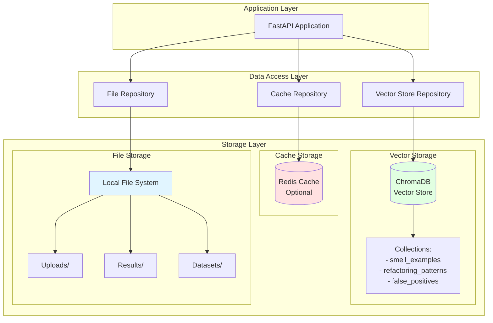

# Database & Vector Store Architecture
## Data Storage Design for Code Review System

**Version:** 1.0  
**Last Updated:** February 9, 2026

---

## 1. Data Architecture Overview



---

## 2. Vector Store Design (ChromaDB)

### 2.1 Collections Schema

**Collection 1: code_smell_examples**

Purpose: Store validated code smell examples from MaRV dataset

```python
{
    "name": "code_smell_examples",
    "metadata": {
        "description": "Manually validated code smell examples",
        "source": "MaRV dataset",
        "indexed_date": "2026-02-09"
    },
    "embedding_function": "sentence-transformers/all-MiniLM-L6-v2"
}
```

**Document Structure:**
```json
{
    "id": "smell_long_method_001",
    "document": "public void processOrder(Order order) {\n    validateOrder(order);\n    ...\n}",
    "embedding": [0.123, 0.456, ..., 0.789],  // 384 dimensions
    "metadata": {
        "smell_type": "Long Method",
        "language": "java",
        "severity": "high",
        "validated": true,
        "lines_of_code": 85,
        "cyclomatic_complexity": 12,
        "parameters": 3,
        "source_file": "OrderProcessor.java",
        "explanation": "This method exceeds 50 lines and performs multiple responsibilities including validation, processing, and persistence.",
        "refactoring_suggestion": "Extract separate methods for validation, business logic, and persistence operations.",
        "metrics": {
            "loc": 85,
            "cc": 12,
            "params": 3,
            "nesting_depth": 4
        }
    }
}
```

**Indexes:**
- Primary: Document ID (automatic)
- Secondary: smell_type, language, severity
- Vector: Embedding (automatic HNSW index)

---

**Collection 2: refactoring_patterns**

Purpose: Store refactoring patterns and examples

```json
{
    "id": "refactor_extract_method_001",
    "document": "Before: [long method code]\nAfter: [refactored code]",
    "embedding": [...],
    "metadata": {
        "pattern_name": "Extract Method",
        "applicable_smells": ["Long Method", "Duplicate Code"],
        "language": "java",
        "effectiveness_rating": 4.5,
        "complexity": "medium",
        "before_code": "...",
        "after_code": "...",
        "explanation": "Extract coherent code blocks into separate methods"
    }
}
```

---

**Collection 3: false_positives**

Purpose: Track known false positive patterns to improve accuracy

```json
{
    "id": "fp_builder_pattern_001",
    "document": "public class OrderBuilder {\n    public OrderBuilder withId(String id) { ... }\n    ...\n}",
    "embedding": [...],
    "metadata": {
        "falsely_flagged_as": "Long Parameter List",
        "reason": "Builder pattern legitimately requires many setter methods",
        "language": "java",
        "pattern": "Builder Pattern",
        "avoid_flag": true,
        "confidence_reduction": 0.3
    }
}
```

---

### 2.2 ChromaDB Configuration

**Configuration File: `chromadb_config.py`**

```python
from chromadb.config import Settings

chroma_settings = Settings(
    # Storage
    persist_directory="./storage/chromadb",
    chroma_db_impl="duckdb+parquet",  # Persistent storage
    
    # Performance
    anonymized_telemetry=False,
    allow_reset=True,
    
    # HNSW Index Parameters
    hnsw_space="cosine",  # or "l2", "ip"
    hnsw_construction_ef=100,
    hnsw_search_ef=100,
    hnsw_M=16,
    
    # Batch size
    batch_size=1000
)
```

**Index Parameters Explanation:**
- `hnsw_space`: Distance metric (cosine similarity for semantic search)
- `hnsw_construction_ef`: Higher = better recall, slower indexing (default: 100)
- `hnsw_search_ef`: Higher = better search quality, slower queries (default: 10)
- `hnsw_M`: Number of connections per node (default: 16)

### 2.3 Vector Store Operations

**Indexing Operations:**

```python
class VectorStoreRepository:
    """Repository for vector store operations."""
    
    def __init__(self, client: ChromaDB):
        self.client = client
        self.collections = self._initialize_collections()
    
    async def add_examples(
        self,
        examples: List[Dict],
        collection_name: str = "code_smell_examples"
    ):
        """Add code smell examples to vector store."""
        collection = self.collections[collection_name]
        
        # Prepare data
        ids = [ex["id"] for ex in examples]
        documents = [ex["code"] for ex in examples]
        embeddings = [ex["embedding"] for ex in examples]
        metadatas = [ex["metadata"] for ex in examples]
        
        # Batch insert
        collection.add(
            ids=ids,
            documents=documents,
            embeddings=embeddings,
            metadatas=metadatas
        )
    
    async def search_similar(
        self,
        query_embedding: List[float],
        k: int = 5,
        filters: Optional[Dict] = None,
        collection_name: str = "code_smell_examples"
    ) -> List[Dict]:
        """Search for similar code examples."""
        collection = self.collections[collection_name]
        
        # Build filter query
        where_clause = None
        if filters:
            where_clause = {}
            if "smell_type" in filters:
                where_clause["smell_type"] = filters["smell_type"]
            if "language" in filters:
                where_clause["language"] = filters["language"]
        
        # Query
        results = collection.query(
            query_embeddings=[query_embedding],
            n_results=k,
            where=where_clause,
            include=["documents", "metadatas", "distances"]
        )
        
        # Format results
        formatted = []
        for i in range(len(results["ids"][0])):
            formatted.append({
                "id": results["ids"][0][i],
                "code": results["documents"][0][i],
                "metadata": results["metadatas"][0][i],
                "similarity": 1 - results["distances"][0][i],  # Convert distance to similarity
                "distance": results["distances"][0][i]
            })
        
        return formatted
    
    async def update_example(
        self,
        example_id: str,
        updates: Dict,
        collection_name: str = "code_smell_examples"
    ):
        """Update an existing example."""
        collection = self.collections[collection_name]
        
        collection.update(
            ids=[example_id],
            documents=[updates.get("code")] if "code" in updates else None,
            metadatas=[updates.get("metadata")] if "metadata" in updates else None,
            embeddings=[updates.get("embedding")] if "embedding" in updates else None
        )
    
    async def delete_examples(
        self,
        example_ids: List[str],
        collection_name: str = "code_smell_examples"
    ):
        """Delete examples by IDs."""
        collection = self.collections[collection_name]
        collection.delete(ids=example_ids)
    
    async def get_collection_stats(
        self,
        collection_name: str = "code_smell_examples"
    ) -> Dict:
        """Get collection statistics."""
        collection = self.collections[collection_name]
        
        count = collection.count()
        
        # Get smell type distribution
        all_metadata = collection.get(include=["metadatas"])
        smell_distribution = {}
        
        for meta in all_metadata["metadatas"]:
            smell_type = meta.get("smell_type", "Unknown")
            smell_distribution[smell_type] = smell_distribution.get(smell_type, 0) + 1
        
        return {
            "total_documents": count,
            "collection_name": collection_name,
            "smell_type_distribution": smell_distribution
        }
```

---

## 3. Cache Layer (Redis - Optional)

### 3.1 Cache Schema

**Purpose:** Cache LLM responses to reduce redundant API calls and improve latency

**Key Structure:**
```
codereview:analysis:{hash}
```

Where `hash` = SHA256(code + model + temperature + top_p + ...)

**Value Structure:**
```json
{
    "result": {
        "smells_detected": [...],
        "overall_assessment": "...",
        "confidence": 0.85
    },
    "metadata": {
        "model_used": "llama3:8b",
        "cached_at": "2026-02-09T10:30:00Z",
        "hit_count": 3
    }
}
```

**TTL:** 7 days (604800 seconds)

### 3.2 Cache Operations

```python
import hashlib
import json
from typing import Optional
import redis.asyncio as redis

class CacheRepository:
    """Repository for cache operations."""
    
    def __init__(self, redis_client: Optional[redis.Redis] = None):
        self.redis = redis_client
        self.ttl = 7 * 24 * 60 * 60  # 7 days
        self.key_prefix = "codereview:analysis:"
    
    def generate_key(
        self,
        code: str,
        language: str,
        mode: str,
        **kwargs
    ) -> str:
        """Generate cache key from inputs."""
        # Normalize code
        normalized_code = code.strip().replace("\r\n", "\n")
        
        # Create key data
        key_data = f"{normalized_code}|{language}|{mode}|{json.dumps(kwargs, sort_keys=True)}"
        
        # Hash
        key_hash = hashlib.sha256(key_data.encode()).hexdigest()
        
        return f"{self.key_prefix}{key_hash}"
    
    async def get(self, key: str) -> Optional[Dict]:
        """Get cached result."""
        if not self.redis:
            return None
        
        cached = await self.redis.get(key)
        
        if cached:
            # Increment hit count
            data = json.loads(cached)
            data["metadata"]["hit_count"] = data["metadata"].get("hit_count", 0) + 1
            
            # Update cache with new hit count
            await self.redis.setex(key, self.ttl, json.dumps(data))
            
            return data["result"]
        
        return None
    
    async def set(self, key: str, result: Dict, ttl: Optional[int] = None):
        """Set cache value."""
        if not self.redis:
            return
        
        data = {
            "result": result,
            "metadata": {
                "cached_at": datetime.utcnow().isoformat(),
                "hit_count": 0
            }
        }
        
        await self.redis.setex(
            key,
            ttl or self.ttl,
            json.dumps(data)
        )
    
    async def invalidate(self, pattern: str = "*"):
        """Invalidate cache entries matching pattern."""
        if not self.redis:
            return
        
        keys = await self.redis.keys(f"{self.key_prefix}{pattern}")
        
        if keys:
            await self.redis.delete(*keys)
    
    async def get_stats(self) -> Dict:
        """Get cache statistics."""
        if not self.redis:
            return {"enabled": False}
        
        keys = await self.redis.keys(f"{self.key_prefix}*")
        total_keys = len(keys)
        
        total_hits = 0
        for key in keys[:100]:  # Sample first 100
            data = await self.redis.get(key)
            if data:
                metadata = json.loads(data).get("metadata", {})
                total_hits += metadata.get("hit_count", 0)
        
        return {
            "enabled": True,
            "total_entries": total_keys,
            "estimated_total_hits": total_hits * (total_keys / min(100, total_keys) if total_keys > 0 else 1),
            "memory_usage": await self.redis.info("memory")
        }
```

---

## 4. File Storage

### 4.1 Directory Structure

```
storage/
├── chromadb/                 # ChromaDB persistent data
│   ├── index/
│   └── data/
│
├── uploads/                  # Temporary uploaded files
│   └── {date}/
│       └── {uuid}.java
│
├── results/                  # Analysis results
│   └── {date}/
│       └── {result_id}.json
│
├── datasets/                 # MaRV dataset cache
│   └── marv/
│       ├── smells/
│       └── metadata.json
│
├── models/                   # Downloaded LLM models (optional)
│   └── embeddings/
│
└── logs/                     # Application logs
    └── {date}.log
```

### 4.2 File Repository

```python
import os
import json
import aiofiles
from pathlib import Path
from typing import Optional
from datetime import datetime

class FileRepository:
    """Repository for file operations."""
    
    def __init__(
        self,
        upload_dir: str = "./storage/uploads",
        results_dir: str = "./storage/results"
    ):
        self.upload_dir = Path(upload_dir)
        self.results_dir = Path(results_dir)
        
        # Create directories
        self.upload_dir.mkdir(parents=True, exist_ok=True)
        self.results_dir.mkdir(parents=True, exist_ok=True)
    
    async def save_upload(
        self,
        file_content: bytes,
        filename: str,
        file_extension: str = ".java"
    ) -> str:
        """Save uploaded file."""
        # Create date-based subdirectory
        today = datetime.utcnow().strftime("%Y-%m-%d")
        upload_dir = self.upload_dir / today
        upload_dir.mkdir(exist_ok=True)
        
        # Generate unique filename
        file_id = str(uuid.uuid4())
        filepath = upload_dir / f"{file_id}{file_extension}"
        
        # Save file
        async with aiofiles.open(filepath, "wb") as f:
            await f.write(file_content)
        
        return str(filepath)
    
    async def save_result(
        self,
        result_id: str,
        result_data: Dict
    ) -> str:
        """Save analysis result."""
        # Create date-based subdirectory
        today = datetime.utcnow().strftime("%Y-%m-%d")
        results_dir = self.results_dir / today
        results_dir.mkdir(exist_ok=True)
        
        # Save result
        filepath = results_dir / f"{result_id}.json"
        
        async with aiofiles.open(filepath, "w") as f:
            await f.write(json.dumps(result_data, indent=2))
        
        return str(filepath)
    
    async def load_result(
        self,
        result_id: str
    ) -> Optional[Dict]:
        """Load analysis result."""
        # Search in all date subdirectories
        for date_dir in self.results_dir.iterdir():
            if date_dir.is_dir():
                filepath = date_dir / f"{result_id}.json"
                if filepath.exists():
                    async with aiofiles.open(filepath, "r") as f:
                        content = await f.read()
                        return json.loads(content)
        
        return None
    
    async def cleanup_old_files(self, days: int = 30):
        """Clean up files older than specified days."""
        cutoff = datetime.utcnow() - timedelta(days=days)
        
        for directory in [self.upload_dir, self.results_dir]:
            for date_dir in directory.iterdir():
                if date_dir.is_dir():
                    # Parse date from directory name
                    try:
                        dir_date = datetime.strptime(date_dir.name, "%Y-%m-%d")
                        if dir_date < cutoff:
                            shutil.rmtree(date_dir)
                            logger.info(f"Cleaned up old directory: {date_dir}")
                    except ValueError:
                        continue
```

---

## 5. Data Initialization & Seeding

### 5.1 MaRV Dataset Indexing

```python
import pandas as pd
from pathlib import Path

class DatasetIndexer:
    """Index MaRV dataset into vector store."""
    
    def __init__(
        self,
        vector_store: VectorStoreRepository,
        embedding_service: EmbeddingService
    ):
        self.vector_store = vector_store
        self.embedding_service = embedding_service
    
    async def index_marv_dataset(
        self,
        dataset_path: str = "./storage/datasets/marv"
    ):
        """Index MaRV dataset into ChromaDB."""
        dataset_path = Path(dataset_path)
        
        # Load dataset metadata
        metadata_file = dataset_path / "metadata.json"
        with open(metadata_file, "r") as f:
            metadata = json.load(f)
        
        # Process each smell type
        for smell_type in metadata["smell_types"]:
            await self._index_smell_type(dataset_path, smell_type)
    
    async def _index_smell_type(
        self,
        dataset_path: Path,
        smell_type: str
    ):
        """Index examples for a specific smell type."""
        smell_dir = dataset_path / "smells" / smell_type.lower().replace(" ", "_")
        
        examples = []
        
        # Iterate through example files
        for example_file in smell_dir.glob("*.java"):
            # Read code
            with open(example_file, "r") as f:
                code = f.read()
            
            # Read annotations
            annotation_file = example_file.with_suffix(".json")
            with open(annotation_file, "r") as f:
                annotations = json.load(f)
            
            # Generate embedding
            embedding = await self.embedding_service.embed(code)
            
            # Create example
            example = {
                "id": f"smell_{smell_type.lower().replace(' ', '_')}_{example_file.stem}",
                "code": code,
                "embedding": embedding.tolist(),
                "metadata": {
                    "smell_type": smell_type,
                    "language": "java",
                    "severity": annotations.get("severity", "medium"),
                    "validated": True,
                    "source_file": str(example_file),
                    **annotations.get("metrics", {})
                }
            }
            
            examples.append(example)
            
            # Batch insert every 100 examples
            if len(examples) >= 100:
                await self.vector_store.add_examples(examples)
                logger.info(f"Indexed {len(examples)} examples for {smell_type}")
                examples = []
        
        # Insert remaining
        if examples:
            await self.vector_store.add_examples(examples)
            logger.info(f"Indexed {len(examples)} examples for {smell_type}")
```

### 5.2 Database Initialization Script

```python
# scripts/init_database.py

import asyncio
from pathlib import Path

async def initialize_database():
    """Initialize all data stores."""
    
    logger.info("Initializing database...")
    
    # 1. Initialize ChromaDB collections
    logger.info("Creating ChromaDB collections...")
    vector_store = get_vector_store()
    await vector_store.create_collections()
    
    # 2. Index MaRV dataset
    logger.info("Indexing MaRV dataset...")
    indexer = DatasetIndexer(vector_store, get_embedding_service())
    await indexer.index_marv_dataset()
    
    # 3. Initialize Redis (if configured)
    if settings.REDIS_HOST:
        logger.info("Initializing Redis cache...")
        cache = get_cache()
        await cache.ping()
    
    # 4. Create file storage directories
    logger.info("Creating storage directories...")
    file_repo = get_file_repository()
    # Directories created automatically in __init__
    
    logger.info("Database initialization complete!")

if __name__ == "__main__":
    asyncio.run(initialize_database())
```

---

## 6. Data Migration & Backup

### 6.1 Backup Strategy

```python
class BackupService:
    """Service for backing up data."""
    
    async def backup_vector_store(
        self,
        backup_dir: str = "./backups"
    ):
        """Backup ChromaDB data."""
        backup_path = Path(backup_dir) / datetime.utcnow().strftime("%Y%m%d_%H%M%S")
        backup_path.mkdir(parents=True, exist_ok=True)
        
        # Copy ChromaDB directory
        import shutil
        shutil.copytree(
            "./storage/chromadb",
            backup_path / "chromadb"
        )
        
        logger.info(f"Vector store backed up to {backup_path}")
    
    async def backup_results(
        self,
        backup_dir: str = "./backups"
    ):
        """Backup analysis results."""
        backup_path = Path(backup_dir) / datetime.utcnow().strftime("%Y%m%d_%H%M%S")
        backup_path.mkdir(parents=True, exist_ok=True)
        
        import shutil
        shutil.copytree(
            "./storage/results",
            backup_path / "results"
        )
        
        logger.info(f"Results backed up to {backup_path}")
```

---

## 7. Performance Considerations

### 7.1 Indexing Performance

**Batch Size:** 100-1000 documents per batch
**Embedding Generation:** Asynchronous with batching
**Index Building:** HNSW parameters tuned for recall vs. speed

### 7.2 Query Performance

**Expected Latency:**
- Vector search: 10-50ms for 10K documents
- With filters: 20-100ms
- Cache hit: <5ms

**Optimization Strategies:**
- Pre-filter by metadata before vector search
- Use approximate nearest neighbor (ANN) search
- Cache frequently accessed embeddings
- Batch query processing

---

**Document Version:** 1.0  
**Maintained By:** Data Engineering Team
