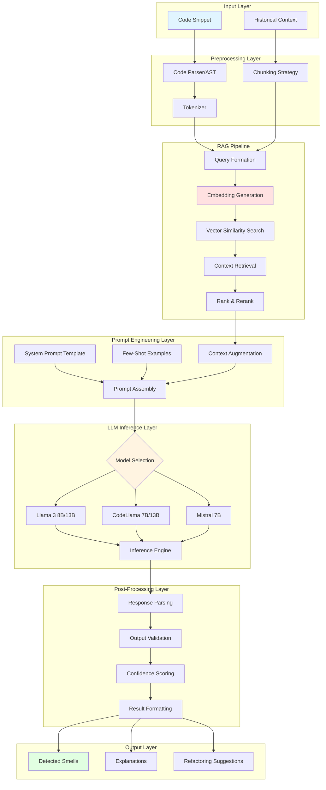

# LLM Architecture Design
## RAG-Enhanced Code Smell Detection System

**Version:** 1.0  
**Last Updated:** February 9, 2026

---

## 1. LLM Architecture Overview



---

## 2. Model Selection Strategy

### 2.1 Available Models

| Model | Parameters | Context Window | Strengths | Use Case |
|-------|-----------|---------------|-----------|----------|
| **Llama 3 8B** | 8B | 8K tokens | General capability, good reasoning | Primary model |
| **Llama 3 13B** | 13B | 8K tokens | Better performance, more accurate | High-priority analysis |
| **CodeLlama 7B** | 7B | 16K tokens | Code-specialized, long context | Large code files |
| **CodeLlama 13B** | 13B | 16K tokens | Best code understanding | Complex analysis |
| **Mistral 7B** | 7B | 32K tokens | Fast, efficient | Quick analysis |

### 2.2 Selection Logic

```python
def select_model(code_length: int, complexity: str, priority: str) -> str:
    """
    Model selection based on code characteristics and requirements.
    
    Args:
        code_length: Number of tokens in code
        complexity: 'simple' | 'medium' | 'complex'
        priority: 'low' | 'medium' | 'high'
    
    Returns:
        Model identifier for Ollama
    """
    if code_length > 8000:
        # Long code needs larger context window
        if priority == 'high':
            return "codellama:13b"
        return "codellama:7b"
    
    if complexity == 'complex' or priority == 'high':
        # Complex analysis needs more capable model
        return "llama3:13b"
    
    # Default: Best balance of speed and capability
    return "llama3:8b"
```

---

## 3. RAG Pipeline Architecture

### 3.1 Embedding Strategy


**Embedding Model:** `sentence-transformers/all-MiniLM-L6-v2`

**Configuration:**
```python
embedding_config = {
    "model_name": "all-MiniLM-L6-v2",
    "dimension": 384,
    "normalize": True,
    "batch_size": 32,
    "device": "cuda" if torch.cuda.is_available() else "cpu"
}
```

**Code Normalization Steps:**
1. Remove comments
2. Normalize whitespace
3. Remove string literals (optional)
4. Extract method/class signatures
5. Tokenize and truncate to max length (512 tokens)

### 3.2 Vector Store Design

**ChromaDB Collections:**

```python
collections = {
    "code_smell_examples": {
        "description": "Validated code smell examples from MaRV dataset",
        "metadata_fields": ["smell_type", "language", "severity", "validated"],
        "embedding_function": embedding_model
    },
    "refactoring_patterns": {
        "description": "Refactoring patterns for each smell type",
        "metadata_fields": ["smell_type", "before_after", "effectiveness"],
        "embedding_function": embedding_model
    },
    "false_positives": {
        "description": "Known false positive patterns to avoid",
        "metadata_fields": ["smell_type", "reason", "context"],
        "embedding_function": embedding_model
    }
}
```

**Document Structure:**
```json
{
  "id": "smell_long_method_001",
  "code": "public void processOrder(Order order) { ... }",
  "smell_type": "Long Method",
  "explanation": "This method exceeds 50 lines and performs multiple responsibilities...",
  "severity": "high",
  "language": "java",
  "validated": true,
  "metrics": {
    "lines_of_code": 85,
    "cyclomatic_complexity": 12,
    "parameters": 3
  },
  "embedding": [0.123, 0.456, ...],  // 384 dimensions
  "source": "marv_dataset"
}
```

### 3.3 Retrieval Strategy

**Top-K Retrieval:**
```python
retrieval_config = {
    "k": 5,  # Retrieve top 5 similar examples
    "similarity_threshold": 0.7,  # Minimum cosine similarity
    "max_context_tokens": 2000,  # Maximum tokens for retrieved context
    "rerank": True,  # Apply reranking
    "diversity": 0.3  # Diversity factor (MMR)
}
```

**Retrieval Process:**
1. **Query Embedding:** Embed input code
2. **Similarity Search:** Find top-K most similar examples
3. **Filtering:** Apply similarity threshold and metadata filters
4. **Reranking:** Score by relevance to specific smell type
5. **Diversity:** Apply Maximal Marginal Relevance (MMR) for variety
6. **Context Assembly:** Format for prompt inclusion

**MMR (Maximal Marginal Relevance):**
```python
def mmr_rerank(query_embedding, candidate_embeddings, lambda_param=0.7, k=5):
    """
    Rerank results for both relevance and diversity.
    
    Args:
        query_embedding: Query vector
        candidate_embeddings: List of candidate vectors
        lambda_param: Trade-off between relevance (1.0) and diversity (0.0)
        k: Number of results to return
    
    Returns:
        Indices of selected candidates
    """
    selected = []
    remaining = list(range(len(candidate_embeddings)))
    
    for _ in range(k):
        mmr_scores = []
        for i in remaining:
            relevance = cosine_similarity(query_embedding, candidate_embeddings[i])
            if selected:
                max_similarity = max([
                    cosine_similarity(candidate_embeddings[i], candidate_embeddings[j])
                    for j in selected
                ])
                diversity = 1 - max_similarity
            else:
                diversity = 1.0
            
            mmr_score = lambda_param * relevance + (1 - lambda_param) * diversity
            mmr_scores.append((i, mmr_score))
        
        best_idx = max(mmr_scores, key=lambda x: x[1])[0]
        selected.append(best_idx)
        remaining.remove(best_idx)
    
    return selected
```

---

## 4. Prompt Engineering

### 4.1 Prompt Template Structure


### 4.2 System Prompt Template

```python
system_prompt = """You are an expert code reviewer specializing in detecting code smells and suggesting improvements. Your analysis should be:

1. **Accurate**: Only flag genuine code smells, avoid false positives
2. **Specific**: Point to exact locations and problematic patterns
3. **Explainable**: Provide clear reasoning for each detection
4. **Actionable**: Suggest concrete refactoring approaches

## Code Smell Types

{smell_definitions}

## Analysis Process

1. Read and understand the provided code
2. Identify potential code smells based on definitions
3. For each smell:
   - Specify the smell type
   - Indicate exact location (line numbers, method names)
   - Explain why it's problematic
   - Rate severity (low/medium/high)
   - Suggest refactoring approach

## Output Format

Return your analysis as a JSON object:

```json
{
  "smells_detected": [
    {
      "smell_type": "Long Method",
      "location": "Line 45-120, method processOrder()",
      "severity": "high",
      "explanation": "This method has 75 lines and handles multiple responsibilities...",
      "affected_code": "code snippet here",
      "suggestion": "Extract separate methods for validation, processing, and persistence"
    }
  ],
  "overall_assessment": "Summary of code quality",
  "confidence": 0.85
}
```

## Important Guidelines

- Be conservative: When in doubt, don't flag as a smell
- Consider context: Some patterns may be justified
- Prioritize: Focus on high-impact smells first
- Use provided examples as reference but think independently
"""
```

### 4.3 Smell Type Definitions

```python
smell_definitions = {
    "Long Method": {
        "definition": "A method that is too long, typically exceeding 50 lines or containing too many responsibilities",
        "indicators": [
            "More than 50 lines of code",
            "Multiple levels of nested logic",
            "Many local variables",
            "Multiple distinct responsibilities"
        ],
        "example": "// Example provided in retrieved context"
    },
    "Large Class": {
        "definition": "A class that tries to do too much, with too many fields, methods, or responsibilities",
        "indicators": [
            "More than 500 lines of code",
            "More than 10 fields",
            "More than 20 methods",
            "Low cohesion between members"
        ],
        "example": "// Example provided in retrieved context"
    },
    "Feature Envy": {
        "definition": "A method that uses methods/fields of another class more than its own",
        "indicators": [
            "Multiple calls to another class's methods",
            "Heavy use of another class's getters",
            "Method seems to belong in another class"
        ],
        "example": "// Example provided in retrieved context"
    },
    # ... other smell types
}
```

### 4.4 Few-Shot Examples Integration

**Zero-Shot (When no examples retrieved):**
```python
prompt = f"""{system_prompt}

## Code to Analyze

```java
{user_code}
```

Analyze the above code for code smells.
"""
```

**Few-Shot (With RAG-retrieved examples):**
```python
prompt = f"""{system_prompt}

## Reference Examples

Here are some validated examples of code smells for reference:

{format_retrieved_examples(retrieved_docs)}

## Code to Analyze

```java
{user_code}
```

Analyze the above code for code smells, using the reference examples to guide your analysis.
"""
```

**Example Formatting:**
```python
def format_retrieved_examples(docs: List[dict]) -> str:
    """Format retrieved examples for prompt inclusion."""
    examples = []
    for doc in docs:
        example = f"""
### Example: {doc['smell_type']}

**Code:**
```{doc['language']}
{doc['code']}
```

**Analysis:**
{doc['explanation']}

**Severity:** {doc['severity']}

---
"""
        examples.append(example)
    
    return "\n".join(examples)
```

---

## 5. LLM Inference Configuration

### 5.1 Inference Parameters

```python
inference_config = {
    # Model Selection
    "model": "llama3:8b",  # Default model
    
    # Generation Parameters
    "temperature": 0.2,  # Low temperature for consistent, factual output
    "top_p": 0.9,        # Nucleus sampling
    "top_k": 40,         # Top-K sampling
    "repeat_penalty": 1.1,  # Prevent repetition
    
    # Length Controls
    "max_tokens": 2048,  # Maximum output length
    "context_window": 8192,  # Model context window
    
    # Performance
    "num_gpu": 1,        # GPUs to use
    "num_thread": 4,     # CPU threads
    "batch_size": 1,     # Inference batch size
    
    # Streaming
    "stream": True,      # Stream responses for UI feedback
    
    # Stop Sequences
    "stop": ["```\n\n", "USER:", "ASSISTANT:"],
    
    # Seed for reproducibility (when needed)
    "seed": None  # Random by default
}
```

### 5.2 Streaming Response Handling

```python
async def stream_llm_inference(prompt: str, config: dict):
    """
    Stream LLM inference with real-time processing.
    
    Yields chunks of text as they're generated.
    """
    async for chunk in ollama_client.generate_stream(
        model=config["model"],
        prompt=prompt,
        options={
            "temperature": config["temperature"],
            "top_p": config["top_p"],
            "top_k": config["top_k"],
            "num_predict": config["max_tokens"]
        }
    ):
        yield chunk["response"]
```

---

## 6. LangGraph Workflow

### 6.1 Analysis Workflow Graph


### 6.2 State Schema

```python
from langgraph.graph import StateGraph
from typing import TypedDict, List, Optional

class AnalysisState(TypedDict):
    # Input
    code: str
    language: str
    analysis_mode: str  # 'quick' | 'thorough' | 'comprehensive'
    
    # Preprocessing
    preprocessed_code: str
    ast: Optional[dict]
    metrics: dict
    
    # RAG
    candidate_smells: List[str]
    retrieved_examples: List[dict]
    context_snippets: List[str]
    
    # LLM
    selected_model: str
    prompt: str
    raw_response: str
    parse_attempts: int
    
    # Results
    detected_smells: List[dict]
    confidence_scores: List[float]
    explanations: List[str]
    validation_status: str
    
    # Metadata
    processing_time: float
    tokens_used: int
    errors: List[str]
```

### 6.3 Node Implementations

**Preprocessing Node:**
```python
def preprocess_node(state: AnalysisState) -> AnalysisState:
    """Preprocess code: normalize, parse, extract metrics."""
    code = state["code"]
    
    # Normalize code
    normalized = remove_comments(code)
    normalized = normalize_whitespace(normalized)
    
    # Parse AST
    try:
        ast = parse_code_to_ast(normalized, state["language"])
    except Exception as e:
        ast = None
        state["errors"].append(f"AST parsing failed: {e}")
    
    # Extract metrics
    metrics = extract_code_metrics(code, ast)
    
    state["preprocessed_code"] = normalized
    state["ast"] = ast
    state["metrics"] = metrics
    
    return state
```

**RAG Retrieval Node:**
```python
async def rag_retrieval_node(state: AnalysisState) -> AnalysisState:
    """Retrieve relevant examples from vector store."""
    # Generate embedding for query code
    query_embedding = await embedding_service.embed(
        state["preprocessed_code"]
    )
    
    # Retrieve for each candidate smell type
    all_examples = []
    for smell_type in state["candidate_smells"]:
        examples = await vector_store.search(
            query_embedding=query_embedding,
            filter={"smell_type": smell_type},
            k=3  # Top 3 per smell type
        )
        all_examples.extend(examples)
    
    # Apply MMR for diversity
    selected = mmr_rerank(
        query_embedding,
        [ex["embedding"] for ex in all_examples],
        k=5
    )
    
    state["retrieved_examples"] = [all_examples[i] for i in selected]
    
    return state
```

**LLM Inference Node:**
```python
async def llm_inference_node(state: AnalysisState) -> AnalysisState:
    """Run LLM inference with streaming."""
    model = state["selected_model"]
    prompt = state["prompt"]
    
    # Stream inference
    full_response = ""
    async for chunk in stream_llm_inference(prompt, {"model": model}):
        full_response += chunk
        # Optional: emit progress events
    
    state["raw_response"] = full_response
    state["parse_attempts"] += 1
    
    return state
```

**Response Validation Node:**
```python
def validate_response_node(state: AnalysisState) -> AnalysisState:
    """Parse and validate LLM response."""
    try:
        # Extract JSON from response (handle markdown code blocks)
        json_str = extract_json_from_response(state["raw_response"])
        
        # Parse JSON
        parsed = json.loads(json_str)
        
        # Validate schema
        validate_smell_detection_schema(parsed)
        
        state["detected_smells"] = parsed["smells_detected"]
        state["confidence_scores"] = [s["confidence"] for s in parsed["smells_detected"]]
        state["validation_status"] = "success"
        
    except Exception as e:
        state["validation_status"] = "failed"
        state["errors"].append(f"Validation error: {e}")
    
    return state
```

---

## 7. Response Post-Processing

### 7.1 Output Validation

**Validation Schema:**
```python
from pydantic import BaseModel, Field, validator
from typing import List, Optional

class CodeSmellDetection(BaseModel):
    smell_type: str = Field(..., description="Type of code smell")
    location: str = Field(..., description="Location in code")
    severity: str = Field(..., pattern="^(low|medium|high)$")
    explanation: str = Field(..., min_length=50)
    affected_code: str
    suggestion: str = Field(..., min_length=30)
    confidence: float = Field(..., ge=0.0, le=1.0)
    
    @validator("smell_type")
    def validate_smell_type(cls, v):
        valid_types = [
            "Long Method", "Large Class", "Feature Envy",
            "Data Clumps", "Long Parameter List", "Divergent Change",
            "Shotgun Surgery", "Switch Statements", "Speculative Generality",
            "Message Chains", "Middle Man", "Primitive Obsession"
        ]
        if v not in valid_types:
            raise ValueError(f"Invalid smell type: {v}")
        return v

class AnalysisResult(BaseModel):
    smells_detected: List[CodeSmellDetection]
    overall_assessment: str
    code_quality_score: Optional[float] = Field(None, ge=0.0, le=100.0)
    timestamp: str
```

### 7.2 Confidence Scoring

```python
def calculate_confidence(smell: dict, state: AnalysisState) -> float:
    """
    Calculate overall confidence score for detection.
    
    Factors:
    - LLM-provided confidence
    - Similarity to retrieved examples
    - Metric-based validation
    - Consistency across retries
    """
    llm_confidence = smell.get("confidence", 0.5)
    
    # Factor 1: Similarity to retrieved examples
    example_sim = 0.0
    if state["retrieved_examples"]:
        max_sim = max([
            ex["similarity"] for ex in state["retrieved_examples"]
            if ex["smell_type"] == smell["smell_type"]
        ] + [0.0])
        example_sim = max_sim
    
    # Factor 2: Metric validation
    metric_support = validate_with_metrics(smell, state["metrics"])
    
    # Weighted combination
    confidence = (
        0.5 * llm_confidence +
        0.3 * example_sim +
        0.2 * metric_support
    )
    
    return min(confidence, 1.0)
```

### 7.3 Hallucination Detection

```python
def detect_hallucinations(smell: dict, original_code: str) -> bool:
    """
    Detect if LLM hallucinated location or code snippets.
    
    Returns True if hallucination detected.
    """
    # Check if mentioned line numbers exist
    if "line" in smell["location"].lower():
        mentioned_lines = extract_line_numbers(smell["location"])
        code_line_count = len(original_code.split("\n"))
        if any(line > code_line_count for line in mentioned_lines):
            return True
    
    # Check if affected code actually appears in original
    if smell.get("affected_code"):
        normalized_original = normalize_code(original_code)
        normalized_affected = normalize_code(smell["affected_code"])
        if normalized_affected not in normalized_original:
            # Allow fuzzy match
            if fuzzy_match_score(normalized_affected, normalized_original) < 0.7:
                return True
    
    return False
```

---

## 8. Error Handling and Fallbacks

### 8.1 Retry Strategy

```python
class RetryConfig:
    max_retries = 3
    backoff_factor = 2  # Exponential backoff
    retry_on_errors = [
        "json_parse_error",
        "validation_error",
        "timeout_error"
    ]

async def llm_call_with_retry(
    prompt: str,
    config: dict,
    retry_config: RetryConfig
) -> str:
    """LLM call with exponential backoff retry."""
    for attempt in range(retry_config.max_retries):
        try:
            response = await ollama_client.generate(prompt, **config)
            return response
        
        except TimeoutError as e:
            if attempt < retry_config.max_retries - 1:
                wait_time = retry_config.backoff_factor ** attempt
                await asyncio.sleep(wait_time)
                continue
            else:
                raise
        
        except Exception as e:
            logger.error(f"LLM call failed (attempt {attempt + 1}): {e}")
            if attempt < retry_config.max_retries - 1:
                # Refine prompt for next attempt
                prompt = refine_prompt_after_error(prompt, str(e))
                await asyncio.sleep(retry_config.backoff_factor ** attempt)
            else:
                raise
```

### 8.2 Fallback Strategies

**Fallback Chain:**


**Implementation:**
```python
async def detect_with_fallback(code: str, config: dict) -> dict:
    """Try multiple approaches with graceful degradation."""
    approaches = [
        ("llama3:13b", llm_based_detection),
        ("llama3:8b", llm_based_detection),
        ("codellama:7b", llm_based_detection),
        ("rule_based", rule_based_detection)
    ]
    
    for model, detection_fn in approaches:
        try:
            if model == "rule_based":
                result = detection_fn(code)
            else:
                result = await detection_fn(code, model=model)
            
            if result["validation_status"] == "success":
                result["detection_method"] = model
                return result
        
        except Exception as e:
            logger.warning(f"Detection failed with {model}: {e}")
            continue
    
    # All approaches failed, return minimal response
    return {
        "smells_detected": [],
        "overall_assessment": "Analysis could not be completed",
        "validation_status": "failed",
        "errors": ["All detection methods failed"]
    }
```

---

## 9. Performance Optimization

### 9.1 Caching Strategy

```python
from functools import lru_cache
import hashlib

class LLMCache:
    """Cache LLM responses for identical inputs."""
    
    def __init__(self, redis_client=None):
        self.redis = redis_client
        self.ttl = 7 * 24 * 60 * 60  # 7 days
    
    def get_cache_key(self, code: str, model: str, config: dict) -> str:
        """Generate cache key from inputs."""
        key_data = f"{code}|{model}|{json.dumps(config, sort_keys=True)}"
        return hashlib.sha256(key_data.encode()).hexdigest()
    
    async def get(self, code: str, model: str, config: dict) -> Optional[dict]:
        """Retrieve cached result."""
        if not self.redis:
            return None
        
        key = self.get_cache_key(code, model, config)
        cached = await self.redis.get(key)
        
        if cached:
            return json.loads(cached)
        return None
    
    async def set(self, code: str, model: str, config: dict, result: dict):
        """Store result in cache."""
        if not self.redis:
            return
        
        key = self.get_cache_key(code, model, config)
        await self.redis.setex(
            key,
            self.ttl,
            json.dumps(result)
        )
```

### 9.2 Batch Processing

```python
async def batch_analyze_codes(
    codes: List[str],
    batch_size: int = 5
) -> List[dict]:
    """Analyze multiple code snippets with batching."""
    results = []
    
    for i in range(0, len(codes), batch_size):
        batch = codes[i:i + batch_size]
        
        # Process batch in parallel
        batch_results = await asyncio.gather(*[
            analyze_code(code) for code in batch
        ], return_exceptions=True)
        
        results.extend(batch_results)
    
    return results
```

---

## 10. Monitoring and Observability

### 10.1 Metrics to Track

```python
llm_metrics = {
    "inference_time": Histogram("llm_inference_seconds"),
    "tokens_per_request": Histogram("llm_tokens_total"),
    "cache_hit_rate": Gauge("llm_cache_hit_rate"),
    "error_rate": Counter("llm_errors_total"),
    "model_usage": Counter("llm_model_calls_total"),
    "validation_failures": Counter("llm_validation_failures_total"),
    "confidence_distribution": Histogram("llm_confidence_scores"),
    "hallucination_rate": Gauge("llm_hallucination_rate")
}
```

### 10.2 Logging

```python
import structlog

logger = structlog.get_logger()

async def analyze_with_logging(code: str, config: dict) -> dict:
    """Analyze code with detailed logging."""
    request_id = generate_request_id()
    
    logger.info(
        "analysis_started",
        request_id=request_id,
        code_length=len(code),
        model=config["model"]
    )
    
    start_time = time.time()
    
    try:
        result = await analyze_code(code, config)
        
        logger.info(
            "analysis_completed",
            request_id=request_id,
            duration=time.time() - start_time,
            smells_found=len(result["smells_detected"]),
            validation_status=result["validation_status"]
        )
        
        return result
    
    except Exception as e:
        logger.error(
            "analysis_failed",
            request_id=request_id,
            duration=time.time() - start_time,
            error=str(e),
            exc_info=True
        )
        raise
```

---

## 11. Future Enhancements

### Short-Term
- [ ] Multi-model ensemble for improved accuracy
- [ ] Active learning from user feedback
- [ ] Adaptive prompt templates per smell type
- [ ] Advanced hallucination detection

### Medium-Term
- [ ] Fine-tuning on code smell dataset
- [ ] Custom embedding model for code
- [ ] Graph-based code representation
- [ ] Explanation quality scoring

### Long-Term
- [ ] Custom LLM trained on code smells
- [ ] Multi-language support beyond Java
- [ ] Real-time learning and adaptation
- [ ] Integration with IDE for live analysis

---

**Document Version:** 1.0  
**Last Review:** February 9, 2026  
**Maintained By:** ML/LLM Team
