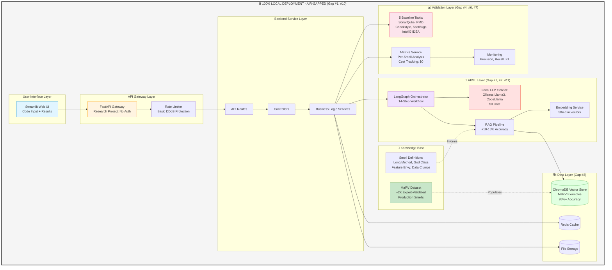
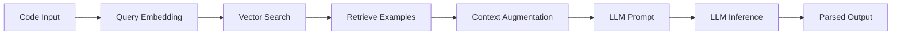
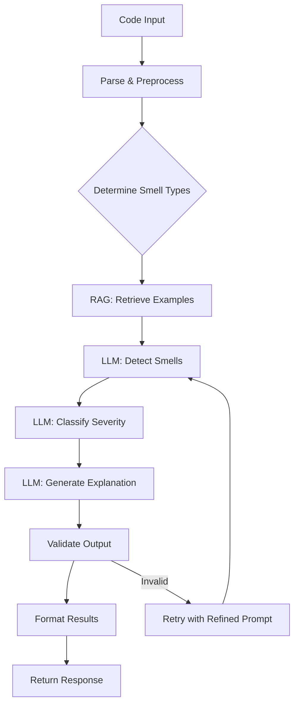
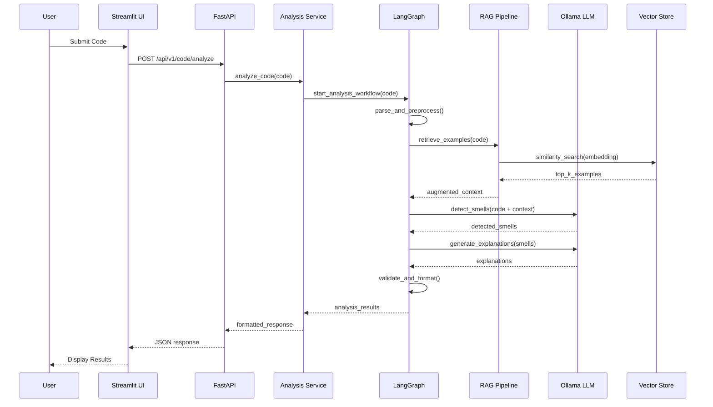
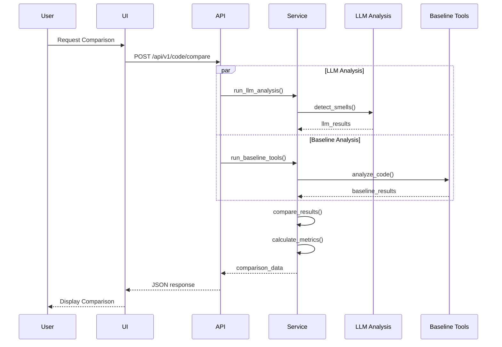
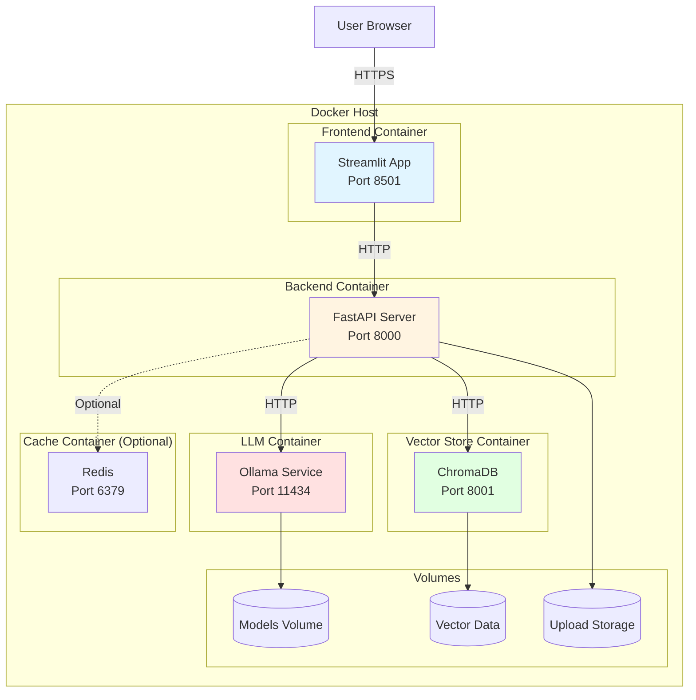
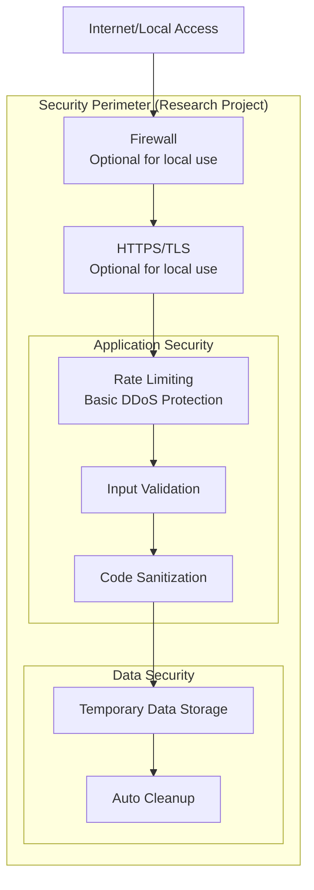
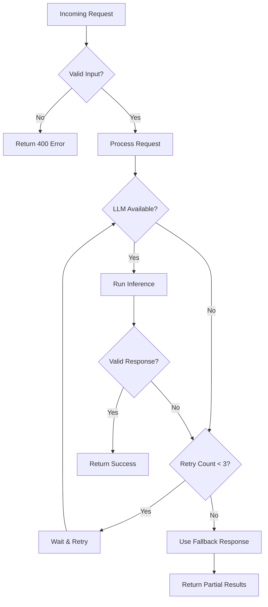

# System Architecture
## Privacy-Preserving, RAG-Enhanced Code Smell Detection System

**Version:** 2.0  
**Last Updated:** February 16, 2026  
**Research Contribution:** First local LLM system for production code smell detection

**Project Type:** Research Project - Designed for local evaluation and academic use  
**Security Model:** No authentication/authorization - Intended for single-user, localhost deployment

---

## Research Novelty

This system addresses **12 research gaps** through a novel architecture:
- 🔒 **100% Local Deployment** - Privacy-preserving (Gap #1, #10)
- 🎯 **RAG Enhancement** - +10-15% accuracy improvement (Gap #2)
- 📚 **Expert Validation** - MaRV dataset 95%+ accuracy (Gap #3)
- 📊 **Systematic Comparison** - 5 baseline tools (Gap #4)
- 💡 **Explanation Quality** - Evidence-based reasoning (Gap #5)
- 💰 **Cost Analysis** - $0 vs cloud APIs (Gap #6)
- 🎯 **Per-Smell Metrics** - Detailed performance breakdown (Gap #7)
- 🔓 **Open Source** - Full reproducibility (Gap #8)
- 📖 **Dataset Study** - 10 datasets compared (Gap #9)
- 🤖 **AI Code Support** - Human + LLM-generated code (Gap #11)
- 🏭 **Production Focus** - Not just test smells (Gap #12)

---

## 1. High-Level Architecture Overview

**Privacy-First, Research-Driven Design**



**Key Architectural Highlights:**
- 🔒 **Complete Privacy**: Zero cloud interaction, all processing local
- 🎯 **RAG-Enhanced**: ChromaDB + MaRV for evidence-based detection
- 💰 **Zero Cost**: $0 per analysis vs $0.01-0.10 for cloud APIs
- 📊 **Systematic Validation**: 5 baseline tool comparisons
- 🤖 **Dual Code Support**: Human-written + AI-generated code
- 🏭 **Production Focus**: Production smells, not test smells

---

## 2. Architecture Layers

### 2.1 Frontend Layer (Streamlit)

**Purpose:** User interface for code submission, review visualization, and results exploration

**Components:**
- **Dashboard Page:** Main entry point, code submission interface
- **Results Viewer:** Display detected code smells with explanations
- **Comparison View:** Side-by-side comparison of LLM vs. baseline tools
- **Analytics Dashboard:** Historical analytics and metrics
- **Settings Panel:** Configuration and preferences

**Technology Stack:**
- Streamlit 1.30+
- Plotly for visualizations
- Pandas for data manipulation
- Requests library for API calls

**Communication:**
- RESTful API calls to FastAPI backend
- HTTP/HTTPS protocol
- JSON data format

---

### 2.2 API Gateway Layer (FastAPI)

**Purpose:** Centralized entry point for all backend services, handles routing and rate limiting

**Note:** As a research project, no authentication/authorization is implemented. The system is designed for local use and evaluation purposes.

**Components:**

1. **API Gateway (FastAPI)**
   - Request routing
   - Response formatting
   - OpenAPI/Swagger documentation
   - CORS configuration

2. **Rate Limiter**
   - Basic request throttling
   - Simple DDoS protection
   - Per-IP rate limiting (optional)

**Endpoints:**
```
POST   /api/v1/code/analyze          # Submit code for analysis
GET    /api/v1/code/results/:id      # Retrieve analysis results
GET    /api/v1/code/history           # Get historical analyses
POST   /api/v1/code/compare           # Compare with baseline tools
GET    /api/v1/smells/types           # List supported smell types
GET    /api/v1/health                 # Health check
```

---

### 2.3 Backend Service Layer

**Purpose:** Business logic, orchestration, and data management

**Structure:**
```
backend/
├── apps/
│   ├── api/              # FastAPI routes and endpoints
│   │   ├── routes/
│   │   │   ├── code_analysis.py
│   │   │   ├── results.py
│   │   │   └── health.py
│   │   └── dependencies.py
│   └── service/          # Business logic
│       ├── code_analyzer.py
│       ├── smell_detector.py
│       ├── result_processor.py
│       └── comparison_service.py
├── core/                 # Core configurations
│   ├── config.py
│   ├── settings.py
│   └── logging_config.py
├── services/             # External integrations
│   ├── llm_service.py
│   ├── rag_service.py
│   ├── embedding_service.py
│   └── vector_store_service.py
├── utils/                # Utilities
│   ├── parsers.py
│   ├── validators.py
│   └── helpers.py
└── models/               # Data models
    ├── requests.py
    ├── responses.py
    └── domain.py
```

**Key Services:**

1. **Code Analyzer Service**
   - Code parsing and preprocessing
   - Language detection
   - AST generation

2. **Smell Detector Service**
   - Orchestrates LLM-based detection
   - Manages detection workflow
   - Aggregates results

3. **Result Processor Service**
   - Formats detection results
   - Calculates metrics
   - Generates explanations

4. **Comparison Service**
   - Runs baseline tools
   - Compares results
   - Statistical analysis

---

### 2.4 AI/ML Layer

**Purpose:** LLM inference, RAG pipeline, and workflow orchestration

**Components:**

#### 2.4.1 LLM Service (Ollama Runtime)

**Models:**
- **Primary:** Llama 3 (8B/13B)
- **Alternative:** CodeLlama (7B/13B)
- **Fallback:** Mistral (7B)

**Capabilities:**
- Code understanding
- Smell detection
- Explanation generation
- Pattern recognition

**Configuration:**
```python
{
    "model": "llama3:8b",
    "temperature": 0.2,
    "top_p": 0.9,
    "max_tokens": 2048,
    "context_window": 8192
}
```

#### 2.4.2 RAG Pipeline

**Workflow:**


**Components:**
- **Embedding Service:** sentence-transformers (all-MiniLM-L6-v2)
- **Vector Store:** ChromaDB or FAISS
- **Retrieval:** Top-K similarity search (K=5)
- **Context Builder:** Formats retrieved examples for prompt

#### 2.4.3 LangGraph Orchestrator

**Detection Workflow:**


**State Management:**
```python
class AnalysisState(TypedDict):
    code: str
    language: str
    parsed_ast: dict
    retrieved_examples: List[dict]
    detected_smells: List[dict]
    explanations: List[str]
    confidence_scores: List[float]
    validation_status: str
```

#### 2.4.4 Embedding Service

**Model:** sentence-transformers/all-MiniLM-L6-v2
- Dimension: 384
- Fast inference
- Good semantic understanding
- Free and open-source

**Usage:**
- Embed code snippets for vector search
- Embed smell descriptions
- Similarity calculation

---

### 2.5 Data Layer

#### 2.5.1 Vector Store (ChromaDB/FAISS)

**Purpose:** Store and retrieve code smell examples

**Collections:**
```
smell_examples/
├── long_method_examples
├── large_class_examples
├── feature_envy_examples
├── data_clumps_examples
└── ...
```

**Document Structure:**
```json
{
  "id": "smell_001",
  "smell_type": "Long Method",
  "code_snippet": "...",
  "explanation": "...",
  "severity": "high",
  "metadata": {
    "language": "java",
    "source": "marv_dataset",
    "validated": true
  },
  "embedding": [0.123, 0.456, ...]
}
```

#### 2.5.2 Cache Layer (Redis - Optional for MVP)

**Purpose:** Cache LLM responses for identical code inputs

**Cache Strategy:**
- **Key:** SHA256 hash of code + model + parameters
- **Value:** Detection results JSON
- **TTL:** 7 days

**Benefits:**
- Reduce redundant LLM calls
- Faster response times
- Cost savings

#### 2.5.3 File Storage

**Purpose:** Store uploaded code files and analysis results

**Structure:**
```
storage/
├── uploads/          # Temporary uploaded files
├── results/          # Analysis results (JSON)
└── datasets/         # MaRV dataset cache
```

---

## 3. Data Flow Diagrams

### 3.1 Code Analysis Flow



### 3.2 Comparison Flow



---

## 4. Technology Stack Summary

### Frontend
| Component | Technology | Version | Purpose |
|-----------|-----------|---------|---------|
| UI Framework | Streamlit | 1.30+ | Web interface |
| Visualization | Plotly | 5.18+ | Charts and graphs |
| Data | Pandas | 2.1+ | Data manipulation |
| HTTP Client | Requests | 2.31+ | API communication |

### Backend
| Component | Technology | Version | Purpose |
|-----------|-----------|---------|---------|
| Web Framework | FastAPI | 0.109+ | REST API |
| ASGI Server | Uvicorn | 0.27+ | Production server |
| Validation | Pydantic | 2.5+ | Data validation |
| Async | AsyncIO | Built-in | Asynchronous operations |

### AI/ML
| Component | Technology | Version | Purpose |
|-----------|-----------|---------|---------|
| LLM Runtime | Ollama | Latest | Local LLM hosting |
| Models | Llama 3, CodeLlama | Latest | Code understanding |
| Orchestration | LangGraph | 0.0.20+ | Workflow management |
| Embeddings | sentence-transformers | 2.3+ | Vector embeddings |
| Vector Store | ChromaDB | 0.4.22+ | Similarity search |
| Alternative VDB | FAISS | 1.7+ | Vector search (optional) |

### Data
| Component | Technology | Version | Purpose |
|-----------|-----------|---------|---------|
| Vector DB | ChromaDB | 0.4.22+ | Embedding storage |
| Cache | Redis | 7.2+ | Response caching (optional) |
| File Storage | Local FS | - | File persistence |

### DevOps
| Component | Technology | Version | Purpose |
|-----------|-----------|---------|---------|
| Containerization | Docker | 24.0+ | Application packaging |
| Orchestration | Docker Compose | 2.24+ | Multi-container setup |
| Version Control | Git | 2.40+ | Source control |
| CI/CD | GitHub Actions | - | Automation |

---

## 5. Deployment Architecture



**Container Specifications:**

| Container | Base Image | CPU | Memory | Storage |
|-----------|-----------|-----|--------|---------|
| Frontend | python:3.11-slim | 0.5 | 512MB | - |
| Backend | python:3.11-slim | 1.0 | 1GB | 1GB |
| Ollama | ollama/ollama:latest | 2.0 | 8GB | 20GB |
| ChromaDB | chromadb/chroma:latest | 1.0 | 2GB | 10GB |
| Redis | redis:7-alpine | 0.5 | 256MB | 1GB |

---

## 6. Security Architecture

### 6.1 Security Layers



### 6.2 Security Measures

**Note:** This is a **research project** for local use and evaluation. Security measures focus on basic protection and safe handling of code submissions, not enterprise-grade authentication/authorization.

**Network Security:**
- Optional HTTPS/TLS for local deployment
- Internal Docker network isolation
- Firewall rules for container communication
- Designed for localhost/single machine use

**Application Security:**
- Input validation for all API requests
- Code sanitization before LLM processing
- Basic rate limiting per IP (prevent abuse)
- CORS configuration for local frontend
- XSS protection in output
- No authentication/authorization (research environment)

**Data Security:**
- No long-term storage of submitted code (privacy by default)
- Temporary file cleanup after analysis (max 24 hours)
- No user accounts or data persistence
- Optional: Local-only storage for historical analysis

**LLM Security:**
- Prompt injection prevention
- Output validation and sanitization
- Model isolation in container
- Resource limits to prevent DoS
- Local execution only (no external API calls)

---

## 7. Scalability Considerations

### 7.1 Horizontal Scaling

**Scalable Components:**
- **Frontend:** Multiple Streamlit instances behind load balancer
- **Backend:** Multiple FastAPI workers via Uvicorn
- **Vector Store:** ChromaDB supports distributed mode

**Non-Scalable (Current Architecture):**
- **Ollama:** Single instance per GPU (future: model serving frameworks)

### 7.2 Vertical Scaling

**Resource Optimization:**
- Model quantization (4-bit, 8-bit) for lower memory
- Batch processing for multiple files
- Connection pooling for database connections
- Caching frequently accessed data

### 7.3 Performance Optimization

**Backend:**
- Async FastAPI endpoints
- Connection pooling
- Response caching (Redis)
- Database query optimization

**LLM Inference:**
- Model quantization
- Batch inference where possible
- Streaming responses for UI feedback
- Model warm-up on startup

**Vector Search:**
- Index optimization
- Approximate nearest neighbor search
- Pre-compute embeddings for static data

---

## 8. Monitoring and Observability

### 8.1 Logging

**Log Levels:**
- **ERROR:** System errors, LLM failures
- **WARNING:** Rate limit hits, validation failures
- **INFO:** Request/response, analysis started/completed
- **DEBUG:** Detailed execution flow

**Log Destinations:**
- Container stdout (Docker logs)
- File logs (persistent volume)
- Optional: Centralized logging (future)

### 8.2 Metrics

**Application Metrics:**
- Request count, response times
- Error rates, success rates
- Active users, concurrent requests

**LLM Metrics:**
- Inference time per request
- Tokens processed
- Model cache hit rate
- Hallucination detection rate

**System Metrics:**
- CPU, memory, disk usage
- Container health status
- Network throughput

### 8.3 Health Checks

**Endpoints:**
```
GET /api/v1/health              # Basic health
GET /api/v1/health/ready        # Readiness probe
GET /api/v1/health/live         # Liveness probe
```

**Health Check Components:**
- API server status
- Ollama connectivity
- Vector store connectivity
- Disk space availability

---

## 9. Error Handling and Resilience

### 9.1 Error Handling Strategy



### 9.2 Resilience Patterns

**Retry Logic:**
- Exponential backoff for LLM calls
- Maximum 3 retries
- Different strategies per error type

**Circuit Breaker:**
- Protect against cascading failures
- Open circuit after 5 consecutive failures
- Half-open state for recovery testing

**Graceful Degradation:**
- Return partial results if possible
- Use cached results when LLM unavailable
- Inform user of degraded service

**Timeout Management:**
- Request timeout: 60 seconds
- LLM inference timeout: 45 seconds
- Database query timeout: 5 seconds

---

## 10. Future Architecture Enhancements

**Note:** These enhancements would be relevant if transitioning from research to production deployment.

### Short-Term (Next 3 Months)
- [ ] Redis caching implementation
- [ ] Metrics dashboard (Prometheus + Grafana)
- [ ] Enhanced logging (structured logs)
- [ ] User feedback collection mechanism

### Medium-Term (3-6 Months)
- [ ] Microservices architecture (separate LLM service)
- [ ] Message queue (RabbitMQ/Kafka) for async processing
- [ ] Multi-model support (ensemble)
- [ ] WebSocket for real-time updates
- [ ] Authentication (if deployed publicly)

### Long-Term (6-12 Months) - Production Deployment
- [ ] Kubernetes deployment
- [ ] Distributed vector store
- [ ] Model fine-tuning pipeline
- [ ] Multi-tenancy support
- [ ] Advanced analytics and ML ops
- [ ] Full authentication/authorization system

---

## 11. Architecture Decision Records (ADRs)

### ADR-001: Use Ollama for Local LLM Hosting
**Status:** Accepted  
**Decision:** Use Ollama instead of custom LLM serving  
**Rationale:** Easy setup, model management, wide model support  
**Consequences:** Limited to Ollama-compatible models

### ADR-002: FastAPI for Backend
**Status:** Accepted  
**Decision:** Use FastAPI instead of Flask/Django  
**Rationale:** Modern, async, auto-documentation, type hints  
**Consequences:** Python 3.7+ required

### ADR-003: ChromaDB for Vector Store
**Status:** Accepted  
**Decision:** Use ChromaDB over FAISS  
**Rationale:** Easier management, built-in persistence, better DX  
**Consequences:** Slightly slower than optimized FAISS

### ADR-004: Monorepo Structure
**Status:** Accepted  
**Decision:** Monorepo with backend + frontend  
**Rationale:** Easier development, shared types, atomic commits  
**Consequences:** Larger repository size

### ADR-005: LangGraph for Orchestration
**Status:** Accepted  
**Decision:** Use LangGraph for workflow management  
**Rationale:** Structured workflows, state management, debuggability  
**Consequences:** Additional dependency, learning curve

---

## 12. Architecture Diagram Legend

**Color Coding:**
- 🔵 Blue: User-facing components
- 🟡 Yellow: API/Gateway layer
- 🔴 Red: AI/ML components
- 🟢 Green: Data storage
- 🟣 Purple: Orchestration/Workflow

**Arrows:**
- Solid: Synchronous communication
- Dashed: Asynchronous/Optional communication
- Thick: High-traffic paths

---

**Document Version:** 1.0  
**Last Review:** February 9, 2026  
**Next Review:** March 1, 2026  
**Maintained By:** Architecture Team
