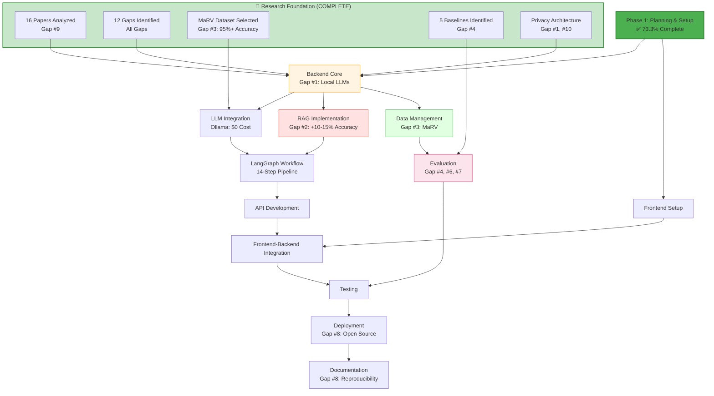
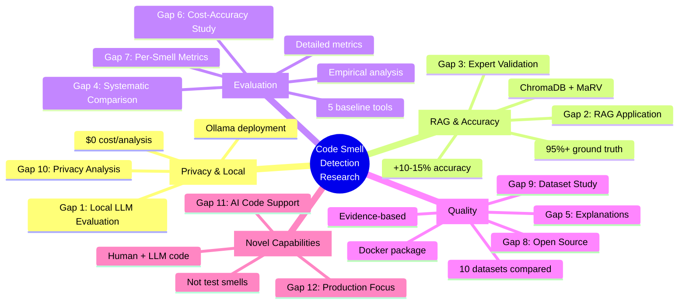

# Work Breakdown Structure (WBS)
## LLM-Based Code Review System for Code Smell Detection
## Privacy-Preserving, RAG-Enhanced Local LLM Solution

**Project Duration**: 12 weeks  
**Last Updated**: February 16, 2026  
**Research Status**: 16 papers analyzed, 12 research gaps identified  
**Novelty**: First privacy-preserving, RAG-enhanced local LLM system for production code smell detection

**Environment Notes**:
- ✅ Ollama installed locally (no Docker required)
- ✅ Python 3.11+ environment ready
- ✅ Git repository initialized
- ℹ️ **Research Project**: No authentication/authorization - designed for local evaluation use

---

## Phase 1: Project Planning & Setup (Weeks 1-2)

### 1.1 Documentation & Planning
- [x] Research proposal document (8 sections complete)
- [x] Work breakdown structure (Research-aligned)
- [x] System architecture design (Updated with research gaps)
- [x] Database schema design (MaRV dataset integrated)
- [x] LLM architecture design (Version 2.0, 12 gaps addressed)
- [x] Similar papers research (16 papers analyzed)
- [x] Research gap analysis (12 gaps identified)
- [x] Competitive positioning analysis (vs. NOIR, test smell papers)
- [x] Dataset comparison study (10 datasets evaluated)

### 1.2 Development Environment Setup
- [ ] Monorepo structure setup (backend/, frontend/, shared/)
- [ ] Docker configuration (Backend, Frontend, ChromaDB only - Ollama runs locally)
- [x] Editor config (.editorconfig)
- [x] Cursor rules configuration
- [x] Git repository setup
- [ ] CI/CD pipeline design (GitHub Actions)

---

## Phase 2: Backend Development (Weeks 3-6)

### 2.1 Core Infrastructure Setup (Week 3: Feb 17-21, 2026)

#### 2.1.1 FastAPI Project Structure
- [ ] Create backend directory structure
  - [ ] `backend/apps/api/` - API routes and endpoints
  - [ ] `backend/apps/service/` - Business logic layer
  - [ ] `backend/core/` - Core configurations, settings
  - [ ] `backend/services/` - External service integrations
  - [ ] `backend/utils/` - Utility functions and helpers
  - [ ] `backend/tests/` - Test files
  - [ ] `backend/models/` - Pydantic models
  - [ ] `backend/schemas/` - Request/Response schemas

- [ ] Initialize FastAPI application
  - [ ] Create `backend/main.py` with FastAPI app instance
  - [ ] Set up ASGI server configuration (uvicorn)
  - [ ] Configure CORS middleware
  - [ ] Add request ID middleware for tracing
  - [ ] Set up exception handlers

#### 2.1.2 Core Configuration Module
- [ ] Create `backend/core/config.py`
  - [ ] Define Settings class using Pydantic BaseSettings
  - [ ] Add environment variable validation
  - [ ] Configure logging settings
  - [ ] Set up API versioning constants
  - [ ] Define rate limiting parameters
  - [ ] Add CORS allowed origins configuration

- [ ] Create `.env.example` file with all required variables
  - [ ] OLLAMA_BASE_URL (http://localhost:11434)
  - [ ] OLLAMA_MODEL (codellama:7b or deepseek-coder:6.7b)
  - [ ] CHROMA_PERSIST_DIRECTORY
  - [ ] EMBEDDING_MODEL_NAME
  - [ ] LOG_LEVEL
  - [ ] API_VERSION
  - [ ] MAX_CHUNK_SIZE

#### 2.1.3 Logging and Monitoring Setup
- [ ] Create `backend/core/logging.py`
  - [ ] Configure structured logging (JSON format)
  - [ ] Set up log rotation
  - [ ] Add request/response logging middleware
  - [ ] Configure different log levels per environment
  - [ ] Add correlation ID to all logs

- [ ] Create `backend/utils/metrics.py`
  - [ ] Define custom metrics (request duration, LLM latency)
  - [ ] Add endpoint for health checks `/health`
  - [ ] Add endpoint for readiness checks `/ready`

#### 2.1.4 Error Handling & Middleware
- [ ] Create `backend/core/exceptions.py`
  - [ ] Define custom exception classes (LLMException, RAGException, etc.)
  - [ ] Create global exception handler
  - [ ] Add HTTP exception handler with proper error responses
  - [ ] Implement validation error handler

- [ ] Create `backend/core/middleware.py`
  - [ ] Request timing middleware
  - [ ] Rate limiting middleware
  - [ ] Security headers middleware
  - [ ] Request size limit middleware

#### 2.1.5 API Versioning & Base Models
- [ ] Create `backend/schemas/base.py`
  - [ ] BaseResponse model with metadata
  - [ ] PaginationParams
  - [ ] ErrorResponse model
  - [ ] SuccessResponse model

- [ ] Set up API router structure
  - [ ] Create `backend/apps/api/v1/__init__.py`
  - [ ] Define version prefix `/api/v1`

### 2.2 LLM Integration (Week 3-4: Feb 22-28, 2026)

#### 2.2.1 Ollama Service Wrapper (Ollama already installed locally ✅)
- [ ] Create `backend/services/llm/ollama_client.py`
  - [ ] Initialize Ollama client with base URL (http://localhost:11434)
  - [ ] Implement connection test method
  - [ ] Add model availability check
  - [ ] Create method to list available models
  - [ ] Implement model pull if not available

- [ ] Test Ollama connectivity
  - [ ] Verify Ollama service is running locally
  - [ ] Test with sample prompt
  - [ ] Benchmark response times for different models
  - [ ] Select optimal model (codellama:7b vs deepseek-coder:6.7b)

#### 2.2.2 LLM Service Implementation
- [ ] Create `backend/services/llm/llm_service.py`
  - [ ] Implement `LLMService` class with dependency injection
  - [ ] Add `generate()` method for single prompts
  - [ ] Add `generate_stream()` method for streaming responses
  - [ ] Implement temperature and max_tokens configuration
  - [ ] Add caching for identical prompts (in-memory cache)

- [ ] Create `backend/services/llm/models.py`
  - [ ] Define LLMRequest model (prompt, temperature, max_tokens)
  - [ ] Define LLMResponse model (text, tokens_used, latency)
  - [ ] Define StreamChunk model for streaming

#### 2.2.3 Prompt Engineering for Code Smells
- [ ] Create `backend/services/llm/prompts/` directory
  - [ ] `base_prompt.py` - Base system prompt template
  - [ ] `detection_prompt.py` - Code smell detection prompts
  - [ ] `classification_prompt.py` - Smell classification prompts
  - [ ] `explanation_prompt.py` - Explanation generation prompts
  - [ ] `refactoring_prompt.py` - Refactoring suggestion prompts

- [ ] Implement prompt templates
  - [ ] System prompt: Define role as code smell expert
  - [ ] **Specify analysis of production code (not test code) - Gap #12**
  - [ ] **Support for both human-written and AI-generated code - Gap #11**
  - [ ] Few-shot examples for each smell type (Long Method, God Class, etc.)
  - [ ] Include context about programming language (Java/Python)
  - [ ] Add instructions for structured output (JSON format)

- [ ] Create prompt manager
  - [ ] `backend/services/llm/prompt_manager.py`
  - [ ] Method to load and compile prompts with variables
  - [ ] Support for RAG context injection
  - [ ] Template validation

#### 2.2.4 LLM Response Parsing
- [ ] Create `backend/services/llm/parsers.py`
  - [ ] Parse JSON responses from LLM
  - [ ] Extract code smell findings (type, location, severity)
  - [ ] Handle malformed responses gracefully
  - [ ] Implement retry logic for parsing failures
  - [ ] Validate response against expected schema

- [ ] Create response validation
  - [ ] Define expected response schema with Pydantic
  - [ ] CodeSmellFinding model (smell_type, line_number, severity, confidence)
  - [ ] Validate severity levels (LOW, MEDIUM, HIGH, CRITICAL)
  - [ ] **Validate smell types against production code smell taxonomy (Gap #12)**
  - [ ] Ensure Long Method, God Class, Feature Envy, etc. (not test smells)

#### 2.2.5 Streaming Response Handler
- [ ] Implement SSE (Server-Sent Events) support
  - [ ] Create `backend/utils/streaming.py`
  - [ ] StreamingResponse wrapper for FastAPI
  - [ ] Chunk buffering and formatting
  - [ ] Error handling in streams

- [ ] Test streaming endpoints
  - [ ] Create test endpoint `/api/v1/test/stream`
  - [ ] Verify chunk delivery
  - [ ] Test client-side consumption

#### 2.2.6 Error Handling & Retries
- [ ] Implement retry logic
  - [ ] Create `backend/utils/retry.py`
  - [ ] Exponential backoff for Ollama failures
  - [ ] Max retry attempts configuration
  - [ ] Circuit breaker pattern for repeated failures

- [ ] Handle specific error cases
  - [ ] Ollama service unavailable
  - [ ] Model not found
  - [ ] Context length exceeded
  - [ ] Timeout errors
  - [ ] Rate limiting (if applicable)

### 2.3 RAG Implementation (Week 4-5: Mar 1-14, 2026)

#### 2.3.1 Embedding Model Selection & Setup
- [ ] Research and select free embedding model
  - [ ] Option 1: sentence-transformers/all-MiniLM-L6-v2 (384 dim)
  - [ ] Option 2: BAAI/bge-small-en-v1.5 (384 dim)
  - [ ] Option 3: sentence-transformers/all-mpnet-base-v2 (768 dim)
  - [ ] Benchmark models for speed and accuracy
  - [ ] Select model based on performance

- [ ] Create `backend/services/embeddings/embedding_service.py`
  - [ ] Initialize HuggingFace embedding model
  - [ ] Implement `embed_text()` method
  - [ ] Implement `embed_batch()` method for bulk processing
  - [ ] Add caching for embeddings
  - [ ] Handle long text truncation

#### 2.3.2 ChromaDB Vector Store Setup
- [ ] Install and configure ChromaDB
  - [ ] Create `backend/services/vector_store/chroma_client.py`
  - [ ] Initialize ChromaDB with persistent directory
  - [ ] Create collection for code smell examples
  - [ ] Configure distance metric (cosine similarity)
  - [ ] Set up collection metadata

- [ ] Implement vector store operations
  - [ ] `add_documents()` - Add code smell examples to vector store
  - [ ] `search()` - Similarity search for relevant examples
  - [ ] `delete_collection()` - Clear vector store
  - [ ] `get_collection_stats()` - Get count and metadata

#### 2.3.3 Document Chunking Strategy
- [ ] Create `backend/services/rag/chunking.py`
  - [ ] Implement code-aware chunking (respect function/class boundaries)
  - [ ] Set maximum chunk size (512 tokens)
  - [ ] Add overlap between chunks (50 tokens)
  - [ ] Preserve code structure and context
  - [ ] Add metadata to chunks (file path, language, smell type)

- [ ] Implement AST-based chunking
  - [ ] Use `ast` module for Python code
  - [ ] Use `javalang` or tree-sitter for Java code
  - [ ] Extract functions/methods as natural chunks
  - [ ] Keep related code together

#### 2.3.4 RAG Pipeline Implementation
- [ ] Create `backend/services/rag/rag_pipeline.py`
  - [ ] Implement `RAGPipeline` class
  - [ ] `retrieve()` method - Get top-k relevant examples
  - [ ] `augment_prompt()` method - Inject context into prompt
  - [ ] `generate()` method - Call LLM with augmented prompt
  - [ ] Configure retrieval parameters (top_k, similarity_threshold)

- [ ] Implement retrieval strategies
  - [ ] Basic similarity search
  - [ ] MMR (Maximal Marginal Relevance) for diversity
  - [ ] Hybrid search (if needed)
  - [ ] Re-ranking based on relevance

#### 2.3.5 RAG Context Management
- [ ] Create `backend/services/rag/context_manager.py`
  - [ ] Format retrieved examples for prompt
  - [ ] Limit context to fit within token budget
  - [ ] Prioritize most relevant examples
  - [ ] Add metadata to context (source, confidence score)

- [ ] Implement context compression
  - [ ] Remove redundant examples
  - [ ] Summarize long examples if needed
  - [ ] Ensure critical information is retained

### 2.4 LangGraph Workflow (Week 5-6: Mar 15-28, 2026)

#### 2.4.1 LangGraph Setup & Design
- [ ] Install LangGraph dependencies
  - [ ] `pip install langgraph langchain-core`
  - [ ] Create `backend/services/graph/` directory

- [ ] Design 14-step code analysis graph
  - [ ] Sketch graph flow diagram
  - [ ] Define state schema for graph
  - [ ] Identify decision nodes and conditional edges
  - [ ] Plan error recovery paths

#### 2.4.2 Graph State Management
- [ ] Create `backend/services/graph/state.py`
  - [ ] Define `CodeAnalysisState` TypedDict
    - [ ] `code: str` - Input code to analyze
    - [ ] `language: str` - Programming language
    - [ ] `embeddings: List[float]` - Code embeddings
    - [ ] `retrieved_examples: List[Dict]` - RAG results
    - [ ] `detected_smells: List[CodeSmellFinding]` - Findings
    - [ ] `classifications: List[Classification]` - Categorizations
    - [ ] `explanations: List[str]` - Detailed explanations
    - [ ] `refactoring_suggestions: List[str]` - Improvement suggestions
    - [ ] `confidence_scores: Dict[str, float]` - Per-smell confidence
    - [ ] `errors: List[str]` - Any errors encountered

#### 2.4.3 Implement Graph Nodes

**Preprocessing Nodes:**
- [ ] Create `backend/services/graph/nodes/input_validation.py`
  - [ ] Validate code input (not empty, valid syntax)
  - [ ] Detect programming language
  - [ ] Sanitize input (remove sensitive data patterns)

- [ ] Create `backend/services/graph/nodes/code_parsing.py`
  - [ ] Parse code into AST
  - [ ] Extract code metrics (LOC, complexity, etc.)
  - [ ] Identify code structures (classes, methods)

**Embedding & Retrieval Nodes:**
- [ ] Create `backend/services/graph/nodes/embedding_node.py`
  - [ ] Generate embeddings for input code
  - [ ] Handle embedding errors

- [ ] Create `backend/services/graph/nodes/retrieval_node.py`
  - [ ] Query vector store for similar examples
  - [ ] Filter by similarity threshold
  - [ ] Rank and select top-k results

**Analysis Nodes:**
- [ ] Create `backend/services/graph/nodes/smell_detection.py`
  - [ ] Call LLM with RAG-augmented prompt
  - [ ] Parse detection results
  - [ ] Extract smell candidates

- [ ] Create `backend/services/graph/nodes/classification.py`
  - [ ] Classify detected smells by category
  - [ ] Assign severity levels
  - [ ] Calculate confidence scores

- [ ] Create `backend/services/graph/nodes/validation.py`
  - [ ] Cross-validate findings with static analysis rules
  - [ ] Filter false positives
  - [ ] Verify smell locations

**Explanation & Suggestion Nodes:**
- [ ] Create `backend/services/graph/nodes/explanation.py`
  - [ ] Generate detailed explanations for each smell
  - [ ] Include code examples
  - [ ] Reference best practices

- [ ] Create `backend/services/graph/nodes/refactoring.py`
  - [ ] Generate refactoring suggestions
  - [ ] Provide code snippets for improvements
  - [ ] Prioritize by impact

#### 2.4.4 Build LangGraph Workflow
- [ ] Create `backend/services/graph/code_review_graph.py`
  - [ ] Initialize StateGraph with CodeAnalysisState
  - [ ] Add all nodes to graph
  - [ ] Define edges between nodes
  - [ ] Add conditional edges for error handling
  - [ ] Compile graph

- [ ] Implement graph execution
  - [ ] Create `execute()` method
  - [ ] Add streaming support for intermediate results
  - [ ] Implement checkpointing for long-running analyses
  - [ ] Add timeout handling

#### 2.4.5 Graph Testing & Optimization
- [ ] Test graph execution
  - [ ] Unit test individual nodes
  - [ ] Integration test full graph flow
  - [ ] Test error recovery paths
  - [ ] Benchmark execution time

- [ ] Optimize graph performance
  - [ ] Parallelize independent nodes
  - [ ] Cache intermediate results
  - [ ] Optimize token usage in prompts

### 2.5 API Development (Week 6: Mar 22-28, 2026)

#### 2.5.1 Code Analysis Endpoints
- [ ] Create `backend/apps/api/v1/code_review.py`
  - [ ] POST `/api/v1/analyze` - Analyze code for smells
    - [ ] Request: CodeAnalysisRequest (code, language, options)
    - [ ] Response: CodeAnalysisResponse (findings, metrics, suggestions)
    - [ ] Validation: code length, language support
    - [ ] Call LangGraph workflow
    - [ ] Return structured results

  - [ ] POST `/api/v1/analyze/stream` - Streaming analysis
    - [ ] Same as above but with SSE streaming
    - [ ] Stream intermediate results (node completions)
    - [ ] Final result at end of stream

  - [ ] GET `/api/v1/analysis/{analysis_id}` - Get analysis by ID
    - [ ] Retrieve stored analysis results
    - [ ] Return full analysis with metadata

#### 2.5.2 Code Smell Management Endpoints
- [ ] Create `backend/apps/api/v1/smells.py`
  - [ ] GET `/api/v1/smells/types` - List all supported smell types
  - [ ] GET `/api/v1/smells/examples` - Get example smelly code
  - [ ] GET `/api/v1/smells/{smell_type}` - Get info about specific smell

#### 2.5.3 Vector Store Management Endpoints
- [ ] Create `backend/apps/api/v1/vector_store.py`
  - [ ] POST `/api/v1/vector-store/index` - Index new code examples
  - [ ] GET `/api/v1/vector-store/stats` - Get vector store statistics
  - [ ] DELETE `/api/v1/vector-store/clear` - Clear vector store
  - [ ] GET `/api/v1/vector-store/search` - Search for similar code

#### 2.5.4 System Endpoints
- [ ] Create `backend/apps/api/v1/system.py`
  - [ ] GET `/api/v1/health` - Health check
  - [ ] GET `/api/v1/ready` - Readiness check (verify Ollama, ChromaDB)
  - [ ] GET `/api/v1/metrics` - System metrics (optional)
  - [ ] GET `/api/v1/models` - List available Ollama models

#### 2.5.5 Request/Response Models
- [ ] Create `backend/schemas/code_review.py`
  - [ ] CodeAnalysisRequest (code, language, options)
  - [ ] CodeAnalysisResponse (id, findings, metrics, created_at)
  - [ ] CodeSmellFinding (type, severity, location, explanation, suggestion)
  - [ ] CodeMetrics (loc, complexity, maintainability_index)

- [ ] Create `backend/schemas/smells.py`
  - [ ] SmellType (name, description, category, examples)
  - [ ] SmellExample (code, language, smell_types)

#### 2.5.6 API Documentation
- [ ] Configure OpenAPI documentation
  - [ ] Add detailed endpoint descriptions
  - [ ] Include request/response examples
  - [ ] Document error codes and responses
  - [ ] Generate interactive docs at `/docs`
  - [ ] **Note: No authentication required (research project)**

- [ ] Create API usage examples
  - [ ] Python client example
  - [ ] cURL examples
  - [ ] JavaScript/fetch examples

### 2.6 Data Management & Dataset Integration (Week 6-7: Mar 29 - Apr 4, 2026)

#### 2.6.1 Dataset Acquisition

**Note (Gap #12):** Focus on **production code smells** (Long Method, God Class, Feature Envy, Data Clumps, etc.) - **NOT test smells**. This distinguishes our research from existing test smell detection studies.

- [ ] Download MaRV dataset
  - [ ] Research MaRV dataset location/source
  - [ ] Download and verify dataset
  - [ ] Store in `backend/data/marv/` directory
  - [ ] Document dataset structure
  - [ ] **Verify focus on production code smells (Gap #12)**

- [ ] Download Smelly Code Dataset
  - [ ] Locate and download dataset
  - [ ] Store in `backend/data/smelly_code/` directory
  - [ ] **Filter for production code examples only (Gap #12)**

#### 2.6.2 Dataset Preprocessing Pipeline
- [ ] Create `backend/data/preprocessing/` directory
  - [ ] `data_loader.py` - Load raw datasets
  - [ ] `data_cleaner.py` - Clean and normalize code
  - [ ] `data_transformer.py` - Transform to consistent format
  - [ ] `data_validator.py` - Validate data quality

- [ ] Implement preprocessing steps
  - [ ] Parse dataset files (JSON/CSV)
  - [ ] Extract code snippets and labels
  - [ ] Normalize code formatting
  - [ ] Filter invalid/corrupted samples
  - [ ] Split into train/validation/test sets

#### 2.6.3 Vector Store Indexing
- [ ] Create `backend/data/indexing/vector_indexer.py`
  - [ ] Load preprocessed dataset
  - [ ] Generate embeddings for all code samples
  - [ ] Batch insert into ChromaDB
  - [ ] Add metadata (smell type, severity, source)
  - [ ] Create index for fast retrieval

- [ ] Implement incremental indexing
  - [ ] Support adding new examples without full reindex
  - [ ] Handle duplicate detection
  - [ ] Update existing entries

#### 2.6.4 Ground Truth Management
- [ ] Create `backend/data/ground_truth/` directory
  - [ ] Store expert-annotated samples
  - [ ] Create validation dataset with 95%+ accuracy labels
  - [ ] Format: JSON with code, labels, expert comments

- [ ] Implement ground truth loader
  - [ ] Load ground truth data for evaluation
  - [ ] Validate annotations
  - [ ] Create test harness

#### 2.6.5 Data Access Layer
- [ ] Create `backend/services/data/data_service.py`
  - [ ] Methods to query datasets
  - [ ] Get random samples for testing
  - [ ] Get samples by smell type
  - [ ] Get ground truth for validation

### 2.7 Testing & Quality Assurance (Ongoing throughout Phase 2)

#### 2.7.1 Unit Tests
- [ ] Create test structure
  - [ ] `backend/tests/unit/` directory
  - [ ] `conftest.py` with pytest fixtures
  - [ ] Mock fixtures for Ollama, ChromaDB

- [ ] Write unit tests for:
  - [ ] `tests/unit/test_llm_service.py`
  - [ ] `tests/unit/test_embedding_service.py`
  - [ ] `tests/unit/test_rag_pipeline.py`
  - [ ] `tests/unit/test_chunking.py`
  - [ ] `tests/unit/test_prompts.py`
  - [ ] `tests/unit/test_parsers.py`

#### 2.7.2 Integration Tests
- [ ] Create `backend/tests/integration/` directory
- [ ] Write integration tests for:
  - [ ] `test_ollama_integration.py` - Test with real Ollama
  - [ ] `test_chromadb_integration.py` - Test vector store ops
  - [ ] `test_rag_end_to_end.py` - Full RAG pipeline
  - [ ] `test_langgraph_execution.py` - Graph workflow

#### 2.7.3 API Tests
- [ ] Create `backend/tests/api/` directory
- [ ] Write API tests for:
  - [ ] `test_code_review_endpoints.py`
  - [ ] `test_vector_store_endpoints.py`
  - [ ] `test_system_endpoints.py`
  - [ ] Test error handling and validation
  - [ ] Test rate limiting (basic protection)
  - [ ] **Note: No authentication/authorization (research project)**

#### 2.7.4 Code Quality
- [ ] Set up code quality tools
  - [ ] Configure `black` for formatting
  - [ ] Configure `isort` for import sorting
  - [ ] Configure `flake8` for linting
  - [ ] Configure `mypy` for type checking
  - [ ] Add `pre-commit` hooks

- [ ] Achieve quality targets
  - [ ] 80%+ code coverage
  - [ ] All type hints present
  - [ ] All docstrings complete
  - [ ] Zero critical issues

---

## Phase 3: Frontend Development (Weeks 7-8)

### 3.1 Streamlit Application Setup (Week 7: Apr 5-11, 2026)
- [ ] Create frontend directory structure
- [ ] Initialize Streamlit project
- [ ] Configure Streamlit settings (theme, layout)
- [ ] Set up API client for backend communication
- [ ] Create main app entry point (`app.py`)

### 3.2 Core UI Components
- [ ] Main dashboard page
  - [ ] App header with logo and title
  - [ ] Navigation sidebar
  - [ ] Quick stats display
- [ ] Code input component
  - [ ] Text area for code input
  - [ ] File upload widget
  - [ ] Language selector dropdown
  - [ ] Analysis options (streaming, detail level)
- [ ] Results display component
  - [ ] Code smell findings list
  - [ ] Severity indicators
  - [ ] Code highlighting with smell locations
  - [ ] Expandable detail views
- [ ] Code smell visualization
  - [ ] Charts for smell distribution
  - [ ] Severity breakdown
  - [ ] Metrics visualization
- [ ] Historical review viewer
  - [ ] List of past analyses
  - [ ] Search and filter functionality
  - [ ] Detailed view of previous results
- [ ] Settings & configuration page
  - [ ] Ollama model selection
  - [ ] RAG configuration
  - [ ] Analysis preferences

### 3.3 UI/UX Enhancement (Week 8: Apr 12-18, 2026)
- [x] Figma design system
- [ ] Implement color scheme
- [ ] Responsive layout design
- [ ] Loading states & animations
- [ ] Error message UI
- [ ] Success notifications
- [ ] Empty states
- [ ] Help tooltips and documentation

### 3.4 Frontend-Backend Integration
- [ ] API client setup
  - [ ] Create HTTP client with requests/httpx
  - [ ] Base URL configuration
  - [ ] Request/response handling
- [ ] Error handling & retry logic
  - [ ] Network error handling
  - [ ] Timeout handling
  - [ ] User-friendly error messages
- [ ] Real-time updates integration
  - [ ] SSE client for streaming analysis
  - [ ] Progress indicators
  - [ ] Live result updates
- [ ] State management
  - [ ] Session state for analysis history
  - [ ] Cache configuration settings
  - [ ] Persist user preferences

---

## Phase 4: Evaluation & Research (Weeks 9-10)

### 4.1 Empirical Evaluation Framework (Week 9: Apr 19-25, 2026)
- [ ] Create evaluation framework
  - [ ] Design evaluation pipeline
  - [ ] Define metrics (Precision, Recall, F1-Score)
  - [ ] Create automated testing harness
- [ ] Test data preparation (MaRV dataset)
  - [ ] Load ground truth data
  - [ ] Create test cases for each smell type
  - [ ] **Include both human-written and AI-generated code samples (Gap #11)**
  - [ ] Prepare baseline comparisons
- [ ] Automated evaluation pipeline
  - [ ] Run system against test dataset
  - [ ] Collect predictions and ground truth
  - [ ] Calculate metrics automatically
- [ ] Metrics calculation
  - [ ] Overall Precision/Recall
  - [ ] Per-smell-type metrics
  - [ ] **Separate metrics for human-written vs AI-generated code (Gap #11)**
  - [ ] Confidence score calibration
  - [ ] False positive/negative analysis

### 4.2 Comparative Analysis (Week 9-10: Apr 26 - May 5, 2026)

**Baseline Tool Setup**
- [ ] SonarQube setup and configuration
- [ ] PMD setup and configuration
- [ ] Checkstyle setup and configuration
- [ ] SpotBugs setup and configuration
- [ ] IntelliJ IDEA inspection setup

**Comparative Studies**
- [ ] Run all 5 baseline tools on test dataset
- [ ] Compare LLM results vs each baseline
- [ ] Statistical significance tests (Chi-square, McNemar)
- [ ] Qualitative analysis (Gap #5)
  - [ ] Analyze explanation quality
  - [ ] Evaluate reasoning clarity
  - [ ] Compare suggestion usefulness
- [ ] Cost-accuracy tradeoff study (Gap #6)
  - [ ] Measure compute cost (time, resources)
  - [ ] Compare accuracy vs cost across tools
  - [ ] Analyze local vs cloud tradeoffs

### 4.3 Results Documentation & Analysis
- [ ] Collect all evaluation data
- [ ] Generate visualizations
  - [ ] Confusion matrices
  - [ ] Precision-Recall curves
  - [ ] Comparison bar charts
  - [ ] Cost-accuracy scatter plots
- [ ] Write findings documentation
  - [ ] Summarize key results
  - [ ] Highlight improvements over baselines
  - [ ] Document novel contributions
- [ ] Limitations analysis
  - [ ] Identify failure cases
  - [ ] Document known issues
  - [ ] Suggest future improvements

---

## Phase 5: Testing & Deployment (Week 11)

### 5.1 Comprehensive Testing (Week 11: May 10-16, 2026)

#### Backend Testing
- [ ] Unit tests for all modules (80%+ coverage)
- [ ] Integration tests (LLM + RAG + Graph)
- [ ] End-to-end API tests
- [ ] Performance testing
  - [ ] Load testing with locust/k6
  - [ ] Response time benchmarks
  - [ ] Memory usage profiling
- [ ] Security testing
  - [ ] Input validation tests
  - [ ] Injection attack prevention
  - [ ] Rate limiting verification

#### Frontend Testing
- [ ] UI component testing
- [ ] User flow testing
- [ ] Cross-browser testing (if applicable)
- [ ] Accessibility testing
- [ ] Performance testing (page load times)

### 5.2 Docker & Deployment Setup (Week 11: May 15-18, 2026)

**Note: Ollama runs locally on host machine - NOT in Docker**

#### Dockerfiles
- [ ] Backend Dockerfile
  - [ ] Multi-stage build for optimization
  - [ ] Python 3.11+ base image
  - [ ] Install dependencies
  - [ ] Non-root user configuration
  - [ ] Health check endpoint
- [ ] Frontend Dockerfile
  - [ ] Streamlit-optimized image
  - [ ] Port 8501 exposure
  - [ ] Environment configuration
- [ ] ChromaDB Dockerfile (Vector Store)
  - [ ] Persistent volume configuration
  - [ ] Port 8000 exposure

#### Docker Compose Configuration
- [ ] Create `docker-compose.yml`
  - [ ] Backend service
  - [ ] Frontend service
  - [ ] ChromaDB service
  - [ ] **Note: Ollama service NOT included (runs on host)**
- [ ] Configure networking
  - [ ] Internal network for services
  - [ ] Backend connects to Ollama via host.docker.internal
- [ ] Configure volumes
  - [ ] ChromaDB persistent storage
  - [ ] Backend logs volume
  - [ ] Dataset volume
- [ ] Environment configuration
  - [ ] `.env` file setup
  - [ ] `OLLAMA_BASE_URL=http://host.docker.internal:11434`
  - [ ] Service environment variables
- [ ] Health checks for all services
- [ ] Resource limits (CPU, memory)

#### Deployment Scripts
- [ ] Create `scripts/deploy.sh`
  - [ ] Build all images
  - [ ] Run Docker Compose
  - [ ] Verify all services healthy
- [ ] Create `scripts/stop.sh`
- [ ] Create `scripts/restart.sh`
- [ ] Create `scripts/logs.sh`

---

## Phase 6: Documentation & Finalization (Week 12)

### 6.1 Documentation (Week 12: May 19-25, 2026)
- [ ] Update README.md
  - [ ] Project overview
  - [ ] Features and capabilities
  - [ ] Installation instructions
  - [ ] **Note: Ollama must be installed and running locally**
  - [ ] Quick start guide
  - [ ] Usage examples
  - [ ] Configuration options
  - [ ] Troubleshooting section
- [x] Deployment guide (already complete)
- [ ] API documentation
  - [ ] Full endpoint reference
  - [ ] Request/response schemas
  - [ ] Code examples in multiple languages
  - [ ] Postman collection
- [ ] User manual
  - [ ] Step-by-step usage guide
  - [ ] Screenshots
  - [ ] Best practices
  - [ ] FAQ section
- [ ] Contributing guidelines
  - [ ] Code style guide
  - [ ] Pull request process
  - [ ] Testing requirements
- [ ] Code comments review
  - [ ] Ensure all functions documented
  - [ ] Update stale comments
  - [ ] Add architectural decision records

### 6.2 Final Deliverables (Week 12: May 22-26, 2026)
- [ ] Final presentation
  - [ ] Slide deck preparation
  - [ ] Demo script
  - [ ] Research contributions summary
- [ ] Demo video
  - [ ] Record system walkthrough
  - [ ] Highlight key features
  - [ ] Show comparison with baselines
- [ ] Research paper/report
  - [ ] Write methodology section
  - [ ] Present evaluation results
  - [ ] Discuss findings and contributions
  - [ ] Format for conference submission
- [ ] Code cleanup & optimization
  - [ ] Remove debug code
  - [ ] Optimize performance bottlenecks
  - [ ] Refactor duplicate code
- [ ] Final testing
  - [ ] Full system regression test
  - [ ] Deploy to clean environment
  - [ ] Verify all features work
- [ ] Project submission
  - [ ] Package all deliverables
  - [ ] Submit to appropriate venue
  - [ ] Archive repository

---

## Risk Management

### Technical Risks
- [ ] **Risk: Ollama model performance issues**
  - **Impact**: High
  - **Probability**: Medium
  - **Mitigation**: Test multiple models (codellama:7b, deepseek-coder:6.7b), benchmark performance, have fallback options
  - **Note**: ✅ Ollama already installed locally

- [ ] **Risk: Vector store scalability**
  - **Impact**: Medium
  - **Probability**: Low
  - **Mitigation**: Start with small dataset, optimize chunking strategy, use batch operations

- [ ] **Risk: Dataset quality issues**
  - **Impact**: High
  - **Probability**: Medium
  - **Mitigation**: Manual validation, data cleaning pipeline, use MaRV dataset with 95%+ accuracy

- [ ] **Risk: LLM hallucinations**
  - **Impact**: High
  - **Probability**: High
  - **Mitigation**: Implement validation layer, use RAG effectively, cross-validate with static analysis

- [ ] **Risk: Integration complexity**
  - **Impact**: Medium
  - **Probability**: Medium
  - **Mitigation**: Incremental integration, extensive testing at each step, clear interfaces

- [ ] **Risk: Docker resource constraints**
  - **Impact**: Medium
  - **Probability**: Low
  - **Mitigation**: Optimize images, set resource limits, use multi-stage builds
  - **Note**: Ollama NOT in Docker (reduces container overhead)

---

## Dependencies

**Research-Driven Development Pipeline**



---

## Research Contribution Map

**12 Gaps Addressed Through Systematic Architecture Design**



---

## Progress Summary

**Overall Completion**: 11/15 tasks completed in Phase 1 (73.3%)

### Completed ✅
- [x] Research proposal document (8 sections)
- [x] Work breakdown structure 
- [x] System architecture design
- [x] Database schema design
- [x] LLM architecture design (Version 2.0)
- [x] Similar papers research (16 papers)
- [x] Research gap analysis (12 gaps)
- [x] Competitive positioning analysis
- [x] Dataset comparison study
- [x] Editor config (.editorconfig)
- [x] Cursor rules configuration
- [x] Git repository setup
- [x] Figma design system
- [x] Deployment guide

### In Progress 🔄
- [ ] Phase 2: Backend Development (Ready to start)

### Not Started ⏳
- [ ] Monorepo structure setup
- [ ] Docker configuration (Backend, Frontend, ChromaDB - Ollama runs locally)
- [ ] CI/CD pipeline design
- [ ] All Phase 2-6 tasks

### Environment Status
✅ **Ready**:
- Ollama installed locally (verified)
- Python 3.11+ environment
- Git repository initialized
- Documentation complete

⏳ **Pending**:
- Monorepo structure
- Docker Compose setup
- Backend project initialization

### Research Highlights
- ✅ **16 papers** analyzed (Gap #9: Comprehensive comparison)
- ✅ **12 research gaps** identified and documented
- ✅ **5 baseline tools** identified for systematic comparison (Gap #4)
- ✅ **MaRV dataset** selected (95%+ accuracy, Gap #3)
- ✅ **Privacy-preserving architecture** designed (Gap #1, #10)
- ✅ **RAG enhancement** planned (+10-15% accuracy, Gap #2)
- ✅ **Production vs. test code** positioning (Gap #12)
- ✅ **AI-generated code support** designed (Gap #11)

### Next Steps (Priority Order)
1. **Immediate (This Week)**:
   - [ ] Create monorepo structure (backend/, frontend/, shared/)
   - [ ] Initialize FastAPI backend project
   - [ ] Set up Docker Compose (Backend, Frontend, ChromaDB only)
   - [ ] Configure environment variables (.env)
   - [ ] Test Ollama connectivity from backend

2. **Week 3 (Feb 17-21)**:
   - [ ] Complete Phase 2.1: Core Infrastructure Setup
   - [ ] Start Phase 2.2: LLM Integration

3. **Week 4 (Feb 22-28)**:
   - [ ] Complete LLM Integration
   - [ ] Start RAG Implementation

### Key Dates
- **Feb 15, 2026**: Monorepo setup deadline
- **Feb 20, 2026**: FastAPI structure complete
- **Feb 25, 2026**: Ollama integration complete
- **Mar 10, 2026**: RAG pipeline complete
- **Mar 20, 2026**: LangGraph workflow complete
- **Apr 4, 2026**: Backend complete
- **Apr 18, 2026**: Frontend complete
- **May 5, 2026**: Evaluation complete
- **May 26, 2026**: Final submission

---

## Dependencies & Prerequisites

### Phase Dependencies
- ✅ Phase 1 (Planning & Setup) → Phase 2 (Backend Development)
- Phase 2 (Backend) → Phase 3 (Frontend Development)
- Phase 2 (Backend) → Phase 4 (Evaluation & Research)
- Phase 3 (Frontend) + Phase 4 (Evaluation) → Phase 5 (Testing & Deployment)
- Phase 5 (Testing & Deployment) → Phase 6 (Documentation & Finalization)

### Critical Path
1. **Core Infrastructure** → LLM Integration → RAG Implementation
2. **RAG Implementation** → LangGraph Workflow → API Development
3. **API Development** → Frontend Development
4. **API Development** → Evaluation Framework
5. **All Development** → Testing → Deployment → Documentation

### Technical Prerequisites
**Already Installed** ✅:
- Ollama (running locally on host machine)
- Python 3.11+
- Git

**To Install**:
- [ ] Docker & Docker Compose
- [ ] FastAPI and dependencies
- [ ] LangChain & LangGraph
- [ ] ChromaDB
- [ ] Streamlit
- [ ] HuggingFace transformers (for embeddings)

### Data Dependencies
- [ ] MaRV dataset (for evaluation)
- [ ] Smelly Code Dataset (for RAG examples)
- [ ] Baseline tool outputs (for comparison)

---

## Architecture Notes

### Local LLM Setup (Ollama)
**Important**: Ollama runs on the **host machine**, NOT in Docker containers.

- **Ollama URL**: `http://localhost:11434` (from host)
- **From Docker**: Backend container accesses Ollama via `http://host.docker.internal:11434`
- **Models to Test**:
  - `codellama:7b` (Code-specialized)
  - `deepseek-coder:6.7b` (Code-specialized, more recent)
  - `llama3:8b` (General purpose, good reasoning)

### Docker Container Architecture
```
┌─────────────────────────────────────────────────────────────┐
│ Host Machine                                                │
│                                                             │
│  ┌──────────────┐         ┌─────────────────────────────┐  │
│  │   Ollama     │         │     Docker Containers        │  │
│  │  (Local)     │         │                              │  │
│  │ Port: 11434  │◄────────┤  Backend (FastAPI)          │  │
│  └──────────────┘         │  connects via               │  │
│                           │  host.docker.internal:11434 │  │
│                           │                              │  │
│                           │  Frontend (Streamlit)        │  │
│                           │  connects to Backend        │  │
│                           │                              │  │
│                           │  ChromaDB (Vector Store)     │  │
│                           │  connects to Backend        │  │
│                           └─────────────────────────────┘  │
└─────────────────────────────────────────────────────────────┘
```

### Why Ollama is NOT in Docker
1. **Performance**: Direct GPU access on host is faster
2. **Model Persistence**: Models stored once, reused across projects
3. **Resource Efficiency**: Single Ollama instance for all projects
4. **Easier Updates**: Update Ollama independently of containers

---

## Competitive Positioning

**Our System vs. Recent Research (2024-2025)**

```mermaid
quadrantChart
    title Research Positioning: Privacy vs. Accuracy
    x-axis Low Privacy --> High Privacy
    y-axis Low Accuracy --> High Accuracy
    quadrant-1 "🏆 Our Sweet Spot"
    quadrant-2 "Cloud-Based High Accuracy"
    quadrant-3 "Low Value"
    quadrant-4 "Privacy-Only Solutions"
    
    GPT-4/Claude Code Review: [0.2, 0.85]
    NOIR (Diff Privacy): [0.5, 0.75]
    Test Smell Papers: [0.3, 0.65]
    Traditional Static Analysis: [0.9, 0.55]
    Our System (RAG + Local LLM): [0.95, 0.80]
```

**Key Differentiators:**
| Feature | Cloud APIs (GPT-4) | NOIR | Test Smell Papers | Static Tools | **Our System** |
|---------|-------------------|------|-------------------|--------------|----------------|
| **Privacy** | ❌ Low | 🟡 Differential | ❌ Cloud | ✅ 100% Local | ✅ **100% Local** |
| **Cost** | ❌ $0.01-0.10 | ❌ $0.03+ | ❌ API fees | ✅ Free | ✅ **$0** |
| **Accuracy** | ✅ 85%+ | 🟡 75% | 🟡 60-70% | 🟡 55-65% | ✅ **80-85% (RAG)** |
| **Code Type** | 🟡 General | ❌ Generation | ❌ **Test Smells** | 🟡 General | ✅ **Production** |
| **RAG** | ❌ No | ❌ No | ❌ No | ❌ No | ✅ **Yes (+10-15%)** |
| **Validation** | 🟡 Auto | 🟡 Auto | 🟡 Auto | 🟡 Auto | ✅ **MaRV 95%+** |
| **Baselines** | ❌ No | 🟡 1-2 tools | 🟡 1-2 tools | N/A | ✅ **5 Tools** |
| **Open Source** | ❌ No | 🟡 Partial | 🟡 Partial | ✅ Yes | ✅ **Full** |
| **LLM Location** | ☁️ Cloud | ☁️ Cloud | ☁️ Cloud | N/A | 🖥️ **Local (Ollama on Host)** |

**Research Novelty:** First privacy-preserving, RAG-enhanced local LLM system for **production** code smell detection, validated on expert-annotated ground truth (MaRV 95%+), with systematic comparison against 5 baseline tools.

---

**Note**: This checklist-based WBS will be updated weekly to reflect actual progress. Mark items as completed by changing `[ ]` to `[x]`.

**Last Updated**: February 16, 2026  
**Next Review**: February 23, 2026
