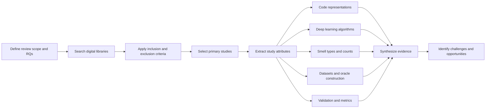
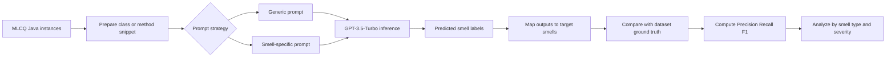
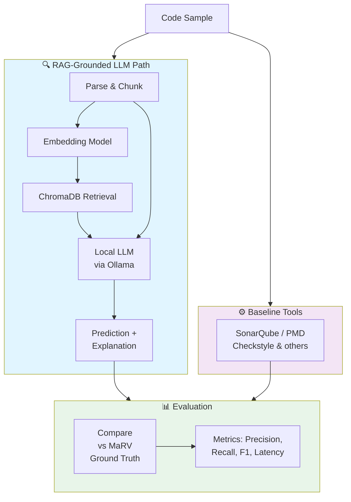

# Local LLM-Based Code Smell Detection
## Related Work, Research Gap, and Project Direction

Bibek Gupta, Erick Orozco, Matthew Gregorat  
Florida Polytechnic University

---

## Why this topic matters

- Code smells increase maintenance cost, technical debt, and change difficulty.
- Traditional static analysis tools are useful, but they often over-flag issues and miss semantic context.
- Deep learning and LLMs may reason about code structure and intent better than fixed rules.
- The central question is whether we can evaluate LLM-based smell detection rigorously, affordably, and privately.

---

## Related work landscape

| Area | Main strength | Main limitation for our project |
| --- | --- | --- |
| Traditional tools | Fast, deterministic, widely adopted | High false positives, weak explanations |
| Deep learning detectors | Learn code patterns automatically | Need labeled data, limited explainability |
| Cloud LLM studies | Strong code understanding, natural language feedback | Privacy concerns, API cost, prompt sensitivity |
| RAG for code tasks | Grounds answers with retrieved context | Rarely applied to code smell detection |

---

## Paper 1: Deep learning review for code smell detection

**Hadj-Kacem and Bouassida, SN Computer Science 2024**

- Systematic literature review of 30 primary studies published from 2018 to January 2023.
- Shows growing use of deep learning for code smell detection through learned code representations.
- Finds fragmented datasets, inconsistent oracles, and narrow smell coverage across prior studies.
- Highlights evaluation problems: different datasets, different validation processes, and limited comparability.

**Takeaway:** the area is promising, but benchmark quality and evaluation consistency remain major weaknesses.

---

## Paper 1 core architecture (end-to-end review pipeline)

- This paper is a systematic synthesis pipeline, not a single detector architecture.
- Its output is the evidence map that motivates stronger benchmarks and evaluation design.

---

## Paper 2: ChatGPT for code smell detection

**Silva et al., ESEM 2024**

- Evaluated GPT-3.5-Turbo on 3,291 Java instances from the MLCQ dataset.
- Compared a generic prompt against a smell-specific prompt.
- Detailed prompting improved outcomes substantially:
  - Data Class F1 increased from 0.11 to 0.59.
  - Long Method reached F1 = 0.46.
  - Odds of a correct result were 2.54x higher with the specific prompt.
- ChatGPT performed better on critical smells than on minor ones.

**Takeaway:** LLMs can detect smells, but results are sensitive to prompt design and remain uneven by smell type.

---

## Paper 2 core architecture (end-to-end detection pipeline)

- Core result: prompt specificity materially improves detection quality.
- Limitation: no retrieval grounding and only one model and language setting.

---

## What the two attached papers tell us together

- Code smell detection with learning-based methods is feasible.
- Performance depends heavily on the quality of the dataset and the quality of the input context.
- Existing studies still struggle with comparability, explanation quality, and consistent evaluation.
- This points toward a stronger setup: expert-validated benchmarks, grounded context retrieval, and systematic baselines.

---

## Additional related work that shapes our proposal

- **MaRV (Karakoç et al., 2023):** expert-validated smell dataset; important because benchmark quality matters.
- **CodeRAG and RAG literature:** retrieval improves code tasks by grounding the model with relevant examples.
- **Code Llama and local LLM deployment work:** makes privacy-preserving local execution feasible on commodity hardware.
- **Recent studies on test smells and LLM-generated smells:** show LLMs can both detect issues and introduce them, which strengthens the case for automated smell detection.

---

## What is still missing in the literature

- Most LLM smell studies rely on commercial cloud APIs.
- Many evaluations use prompt engineering alone instead of grounded retrieval.
- Some benchmarks are noisy, synthetic, or limited to a small smell subset.
- Comparisons with static analysis tools are not always systematic.
- There is still little evidence for a privacy-preserving local workflow that teams can realistically deploy.

---

## Proposed system

**Goal:** combine local LLM reasoning with RAG grounding and compare it fairly against baseline tools.

---

## Research questions and evaluation

- **RQ1:** How accurate are local open-source LLMs versus static analysis tools?
- **RQ2:** Does RAG improve detection accuracy over vanilla prompting?
- **RQ3:** Which smell types are easiest and hardest to detect?
- **RQ4:** What are the latency and resource tradeoffs of local deployment?

**Planned evaluation**

- Dataset: MaRV, using expert-validated Java smell instances.
- Baselines: SonarQube, PMD, Checkstyle, SpotBugs, and IntelliJ inspections.
- Metrics: precision, recall, F1, per-smell breakdown, confusion matrices, and runtime cost.

---

## Current project status

- The core local analysis pipeline is already implemented in this repository.
- The project includes LangGraph orchestration, Ollama integration, ChromaDB retrieval, and ORM-based experiment tracking.
- Immediate next steps are dataset indexing, baseline runs, and full evaluation.
- This means the presentation can discuss both the proposal and the concrete system being built.

---

## Expected contribution

- A privacy-preserving code smell detection workflow that runs fully local.
- A stronger empirical comparison between LLM-based analysis and standard tools.
- Evidence on whether RAG helps beyond prompt tuning alone.
- An open-source evaluation framework other teams can reproduce and extend.

---

## Conclusion

- Related work confirms that LLM-based smell detection is feasible but still methodologically unstable.
- The two papers jointly show that context quality drives outcomes: benchmark quality and prompt context both matter.
- Our project advances this with a full local, grounded, and reproducible pipeline.
- The key expected value is practical evidence for teams: accuracy, explainability, privacy, and runtime tradeoffs in one framework.
- If successful, this can move smell detection from ad hoc prompt demos to deployable engineering practice.

---

## Discussion prompts

- Is explanation quality as important as raw F1 for a code smell detector?
- Would teams trust a local LLM more than a cloud API for code review tasks?
- If prompt wording changes results this much, how should we design fair evaluations?
- Should future work focus more on detection, explanation, or automatic refactoring?

---

## References

1. Hadj-Kacem, M., Bouassida, N. *Application of Deep Learning for Code Smell Detection: Challenges and Opportunities.* SN Computer Science, 2024.
2. Silva, L. L., et al. *Detecting Code Smells using ChatGPT: Initial Insights.* ESEM, 2024.
3. Karakoç, Y., et al. *MaRV: A Manually Validated Refactoring Dataset.* MSR, 2023.
4. Rozière, B., et al. *Code Llama: Open Foundation Models for Code.* 2023.
5. Lewis, P., et al. *Retrieval-Augmented Generation for Knowledge-Intensive NLP Tasks.* 2020.