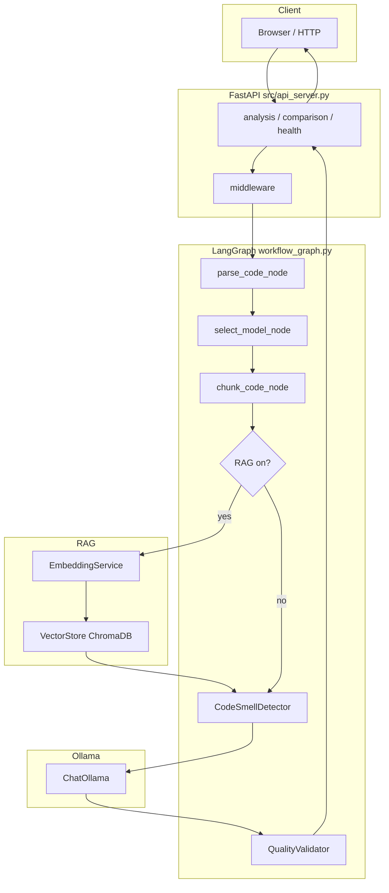
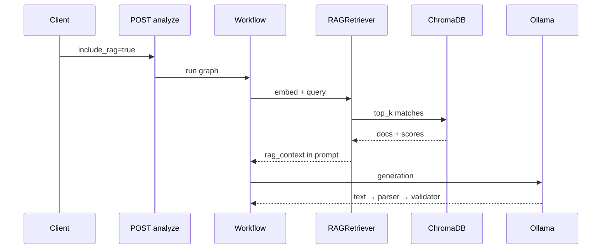
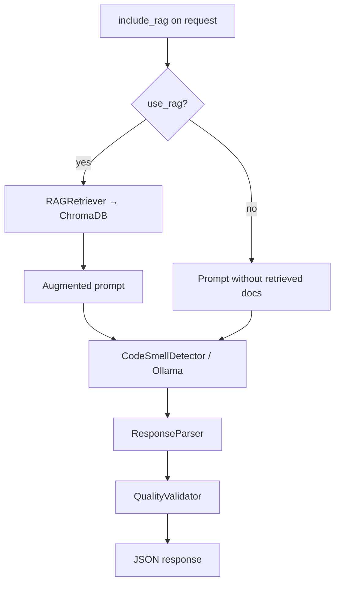

# Slide Deck: Empirical Evaluation of LLM-Based Code Smell Detection

**Course:** CEN5035  
**Subtitle / system:** A Multi-Agent, RAG System (FastAPI · LangGraph · Ollama · ChromaDB)  
**Authors:** Matthew Gregorat · Bibek Gupta · Erick Orozco  
**Institution:** Florida Polytechnic University  

**Repository:** this codebase — paths and behavior refer to files that exist here.  
**Figures / headline metrics:** paste from **`results/`**, **`results/notebook_benchmarks/`**, or experiment logs after real runs—never placeholder CSVs.

---

## Deck map (slide order)

| # | Title |
|---|--------|
| 1 | Title |
| 2 | Problem & motivation |
| 3 | Research questions |
| 4 | Dataset |
| 5 | System architecture |
| 6 | Multi-agent & prompting |
| 7 | RAG integration |
| 8 | Experimental design |
| 9 | Metrics |
| 10 | Results overview |
| 11 | Failure cases |
| 12 | Key insights |
| 13 | Limitations |
| 14 | Contributions |
| 15 | Future work |
| 16 | Demo |
| 17 | Thank you / Q&A |

**Notebook:** `notebooks/eda_smelly_code_dataset.ipynb` (splits, language counts, smell frequencies).

---

## Slide 1 — Title

**Empirical Evaluation of LLM-Based Code Smell Detection**

- **Matthew Gregorat** · **Bibek Gupta** · **Erick Orozco**  
- **A Multi-Agent, RAG System**  
- **CEN5035** — Florida Polytechnic University  

**One-line summary:** Local LLM smell detection with optional **retrieval-augmented** context, **LangGraph** orchestration, and **instance-level** evaluation vs processed ground truth when sample ids resolve.

---

## Slide 2 — Problem & motivation

- **Code smells** hurt maintainability and increase change cost; teams still rely on **manual review** and **slow, inconsistent** judgments.  
- **LLMs** are increasingly used for static-style tasks, but **rigorous evaluation** (benchmarks, per-smell behavior, RAG ablations) often lags adoption.  
- This project targets a **self-hosted** empirical setup: **no cloud LLM API required** when **Ollama** runs locally (`OLLAMA_BASE_URL`, `DEFAULT_MODEL` in `config.py`, e.g. `llama3:8b`).  
- **Structured comparisons:** optional **RAG on/off** on the same pipeline (`include_rag` / `use_rag`); optional comparison to **classical tools** via `scripts/baseline/` and `src/api/routes/comparison.py`.

---

## Slide 3 — Research questions

Framed for this codebase and evaluation harness:

1. **Accuracy:** Can a local LLM **match** human-validated labels at the **smell-instance** level (`calculate_f1_for_findings` in `src/utils/benchmark_utils.py` via `src/api/detection_integration.py`)?  
2. **Generalization:** Do predictions hold across **many smell types** (`CANONICAL_SMELLS` / `normalize_smell_type` in `src/utils/smell_catalog.py` — **35** canonical names)?  
3. **RAG:** Does **retrieval** from **ChromaDB** improve precision/recall/F1 vs the same graph with RAG off?  
4. **Failure modes:** Where do we see **high recall / low precision**, **missed coupling smells**, or **label inconsistency**—and does **catalog-constrained naming** reduce variance?

---

## Slide 4 — Dataset used

- **Manually validated ground truth:** processed JSON under `data/processed/` — **`train.json`**, **`validation.json`**, **`test.json`**, with **`split_metadata.json`** (e.g. seed **42**, **60% / 20% / 20%**). EDA in the notebook currently shows **28** samples total (**16 / 6 / 6**).  
- **Languages in processed splits:** balanced **7** samples each for **cpp**, **java**, **python**, **javascript** (not Java-only).  
- **Annotation scale:** **470** flattened instance rows across splits (for frequency and evaluation scale). Frequent labels in EDA include **Shotgun Surgery**, **Divergent Change**, **Parallel Inheritance Hierarchies**, **Dead Code**, etc.  
- **API scoring default:** `load_ground_truth_from_file` → `data/processed/test.json`; **`resolve_ground_truth_sample_id`** ties **`file_name`** / aliases to benchmark rows.  
- **Figures:** use source trees under `data/datasets/SmellyCodeDataset/**/SmellyAnnotated/` for exploration; **avoid** vendor **`Analysis/`** subtree for paper metrics—generate numbers into **`results/`** from this repo’s scripts.

---

## Slide 5 — System architecture

**End-to-end (implementation-aligned)**

1. **Client** → **FastAPI** (`src/api_server.py`): `analysis`, `comparison`, `health`; middleware `src/api/middleware.py`; static UI `src/static/`.  
2. **Orchestration:** **`WorkflowExecutor`** runs **`src/workflow/workflow_graph.py`** with **`AnalysisState`** (code, chunks, `rag_context`, `detections`, `validated_findings`, `use_rag`, model, …).  
3. **Nodes (typical path):** **`parse_code_node`** (`CodeParser` — metrics, language, syntax where applicable) → **`select_model_node`** (`OllamaClient`, optional user **`model`**) → **`chunk_code_node`** → **RAG** (if enabled) → **`CodeSmellDetector`** → **`QualityValidator`**.  
4. **LLM:** **Ollama** via **`ChatOllama`**; optional **`create_react_agent`** path and tools in `src/analysis/code_smell_detector.py`.  
5. **Output:** **`CodeSmellFindingResponse`** — `smell_type`, `location`, `severity`, `confidence`, `explanation`, optional **`rag_context`**, optional **`suggested_refactoring`**.

**Expanded flow (mermaid)**

---

## Slide 6 — Multi-agent & prompting strategy

- **ReAct-style / tool use:** **`create_react_agent`** (LangGraph prebuilt) and **structured tool calls** in **`CodeSmellDetector`** — structure analysis, optional RAG retrieval, metric-backed helpers (see `code_smell_detector.py` + `code_smell_detector_enhanced.py`).  
- **System + JSON discipline:** **`get_system_prompt()`**, **`ResponseParser`** — expect structured outputs; catalog normalization aligns labels.  

**Two prompt strategies (as implemented in the detector)**

| Mode | Mechanism in code | Role |
|------|-------------------|------|
| **Catalog-wide detection** | `smell_types` omitted or empty | Instruction: *Analyze ALL smell types in the catalog below*; **`build_prompt_catalog_block()`** injects **exact canonical names** for JSON `type`. |
| **Targeted detection** | `smell_types` provided | Instruction: *Focus on: …* — restricts the model to a **subset** of the catalog for that run. |

**Additional templates** (same module family): production / human / AI-oriented analysis builders and **few-shot** wiring in **`src/llm/prompt_templates.py`** (`create_rag_prompt`, `create_prompt_with_few_shot`, etc.).

---

## Slide 7 — RAG integration

- **Embeddings:** `EMBEDDING_MODEL` (default **`sentence-transformers/all-MiniLM-L6-v2`**, **384** dims) — `config.py`.  
- **Store:** **ChromaDB** under **`CHROMADB_DIR`**, collection **`CHROMADB_COLLECTION_NAME`**.  
- **Retrieve:** **`RAGRetriever.find_relevant_examples`** — **`top_k`**, **similarity threshold**, optional **MMR**-style diversity (`diversity_lambda`), optional **reranking** — all from **`RAG_CONFIG`**.  
- **Safety:** **Full-code hash** cache keys (avoid wrong-context reuse) — `src/rag/rag_retriever.py`.  
- **Prompt:** **`create_rag_prompt`** / detector path augments the review prompt with retrieved chunks.  
- **Toggle:** **`CodeSubmissionRequest.include_rag`** → **`AnalysisState.use_rag`**.

---

## Slide 8 — Experimental design

- **Input:** Code snippets (and metadata) via **`POST`** analysis — **`CodeSubmissionRequest`**: `code`, optional **`language`**, **`file_name`**, **`include_rag`**, optional **`model`**, **`timeout_seconds`** (`src/api/models.py`).  
- **Output:** List of findings + optional **precision / recall / F1** when a **ground-truth sample** resolves for the submitted id.  
- **Conditions:** **RAG vs no RAG** on the **same workflow** (`ExperimentType` includes **`baseline`**, **`rag`**, **`ablation`** in `scripts/experiments/run_experiment.py` — verify flags with `--help`).  
- **Baselines:** Static analyzers via **`scripts/baseline/run_tools.py`** (multiple languages/tools — normalize to a common JSON shape).  
- **Batch runs:** **`scripts/experiments/run_experiment.py`**, **`run_ablation_study.py`**; post-hoc **`scripts/analysis/analyze_results.py`**. Artifacts under **`results/`** (`predictions/`, `metrics/`, `performance/`, …).

---

## Slide 9 — Metrics

- **Precision, recall, F1** — instance-oriented matching in **`calculate_f1_for_findings`** (TP / FP / FN returned in the integration layer).  
- **False positives / false negatives** — surfaced via FP/FN counts; use for “false positive rate” narratives when you publish confusion-style tables.  
- **Per-smell breakdown** — derive by grouping predictions and labels by normalized `smell_type` (after **`normalize_smell_type`**); not always a single API field—plan notebook or script aggregation.  
- **Comparison API** — cached summaries in **`src/api/routes/comparison.py`** (agreement buckets, timing — see `_get_empty_summary` and related helpers).

**Slide fill-in:** Replace with your **`results/metrics/*.csv`** and/or **`results/notebook_benchmarks/summary_*.csv`** after real runs.

---

## Slide 10 — Results overview

**Template (no fabricated numbers)**

| Compare | Precision | Recall | F1 | Notes |
|---------|-----------|--------|-----|--------|
| No RAG | … | … | … | … |
| RAG | … | … | … | … |
| Best static tool (if run) | … | … | … | … |

**Plots (if generated):** e.g. `results/notebook_benchmarks/rag_vs_no_rag_bar.png`, `per_sample_f1_rag_vs_plain.png`.

**Per-smell table (template)**

| Smell type | Precision | Recall | F1 | Comment |
|------------|-----------|--------|-----|--------|
| … | … | … | … | … |

**Specify after experiments**

- **Best-performing smell:** (highest F1 or balanced score — fill from aggregates).  
- **Worst-performing smell:** (lowest F1 or systematic misses — fill from aggregates).  
- **Qualitative pattern to report:** e.g. **high recall / low precision** if the model **over-flags** bloaters; tie to **Shotgun Surgery / Divergent Change** frequency in labels vs confusion.

---

## Slide 11 — Failure cases

**Hypotheses consistent with tooling design (validate on your runs)**

- **False positives:** Over-attachment to **surface metrics** (length, nesting) → smell confused with **Long Method** or **Large Class** when the issue is **control-flow complexity**.  
- **Missed context-heavy smells:** **Feature Envy**, **Shotgun Surgery**, **Inappropriate Intimacy** need **cross-method / cross-class** reasoning; **single-file** submission may **lack** surrounding modules.  
- **Inconsistent reasoning:** Same snippet, different runs — mitigated partly by **`temperature`** / **`seed`** in **`LLM_CONFIG`** but not eliminated.  

**Example narrative (paper slide):** *Misclassifying high **cyclomatic complexity** as **Long Method** — complexity vs length require distinct evidence; point to **`code_smell_detector_enhanced`** metrics vs catalog definitions in discussion.*

---

## Slide 12 — Key insights

- **Surface patterns:** LLMs often pick up **long blocks**, **duplication**, **dead-ish** branches when the catalog and prompt stress **measurable** cues.  
- **Semantic / contextual smells:** **Coupling** and **change-pattern** smells may need **more context**, **better retrieval**, or **multi-file** scope — not yet first-class in the default API path.  
- **RAG:** Helps when Chroma has **relevant** exemplars; **hurt** is possible with **noise** or **stale** index — measure **RAG vs no RAG** on the same split.  
- **Prompt specificity:** **Catalog block** + **canonical names** reduce label drift; **targeted `smell_types`** changes precision/recall tradeoffs.

---

## Slide 13 — Limitations

- **Dataset scope:** Small processed split (**28** samples in current EDA) and **470** label instances — **statistical power** limited; **generalization** claims require caution.  
- **Prompt sensitivity:** Wording and **`smell_types`** filters change outputs; auxiliary paths in **`prompt_templates.py`** add variables unless frozen for an experiment.  
- **Single-snippet / limited multi-file context:** Default analysis is **not** a full repository graph; **multi-file** coupling smells are **hard**.  
- **Model & runtime variability:** **Ollama** version, **quantization**, and **hardware** affect reproducibility; **`LLM_CONFIG`** only partially controls determinism.  
- **Infrastructure:** Comparison/analysis caches are **in-memory TTL** — fine for demos, **not** a multi-node production backend.  
- **CPU embeddings by default** (`EMBEDDING_DEVICE`) — latency and throughput limits for large batches.

---

## Slide 14 — Contributions

- **Built** an integrated **FastAPI + LangGraph + Ollama + ChromaDB** pipeline with **optional RAG**, **quality validation**, and **REST + static UI**.  
- **Evaluated** against **processed, manually validated** JSON (**test.json** and full splits) with **instance-level** precision/recall/F1 when ids resolve.  
- **Compared** **RAG vs no RAG** and (optionally) **LLM vs classical tools** using baseline scripts and comparison routes.  
- **Contrasted prompting strategies:** **full catalog** vs **focused smell list**; templates for production-style vs RAG-augmented prompts.  
- **Per-smell** normalization via **`smell_catalog`** enables **aggregated** analysis for tables and ablations.

---

## Slide 15 — Future work

- **Larger or external benchmarks** (e.g. MaRV-oriented expansions) with frozen preprocessing.  
- **Multi-file** and **project-level** context windows or **graph-aware** retrieval.  
- **Stronger RAG:** re-ranking, **freshness**, negative filtering, **collection** design per language.  
- **Calibration:** confidence vs empirical precision; **human** spot audits on failure buckets.  
- **CI:** wire **`scripts/experiments/`** and **`pytest`** into repeatable **`results/`** exports for the paper.

---

## Slide 16 — Demo

1. Configure **`config.py`** (Ollama URL, model, RAG/embedding paths).  
2. Index Chroma if needed: **`scripts/data/index_datasets.py`**.  
3. Ensure **`data/processed/test.json`** for **live F1** in API responses.  
4. **Start:** `src/api_server.py` — use UI or **`POST /api/v1/analyze`** with **`include_rag: true`** and **`false`**.  
5. **Optional:** open **`notebooks/eda_smelly_code_dataset.ipynb`** for split/smell stats.  
6. **Batch:** **`scripts/experiments/run_experiment.py --help`**, then show **`results/metrics/`** or notebook exports in **`results/notebook_benchmarks/`**.

---

## Slide 17 — Thank you

**Thank you.**

**Questions?**

---

## Appendix A — Repository map (reproducibility)

| Topic | Location |
|--------|----------|
| Tunables | `config.py` |
| Smell vocabulary | `src/utils/smell_catalog.py` |
| API | `src/api/models.py`, `src/api/routes/analysis.py` |
| Workflow | `src/workflow/workflow_graph.py` |
| Detector | `src/analysis/code_smell_detector.py` |
| RAG | `src/rag/rag_pipeline.py`, `src/rag/rag_retriever.py` |
| Scoring | `src/api/detection_integration.py`, `src/utils/benchmark_utils.py` |
| Baselines | `scripts/baseline/run_tools.py` |
| EDA | `notebooks/eda_smelly_code_dataset.ipynb` |

---

## Appendix B — Vanilla vs RAG (request flag)

---

*All quantitative claims on slides should match files under `results/` or equivalent experiment logs produced on your machine.*
